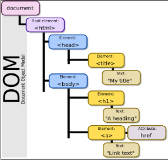
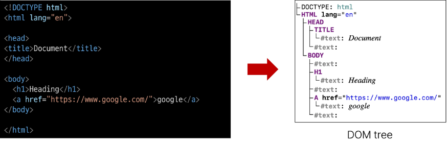

# Introduction of JavaScript

## History of JavaScripts

### 웹의 탄생 (1990) -> 웹브라우저의 대중화(1993) -> JavaScript의 탄생(1995) -> JavaScript 파편화(1996) -> 1차 브라우저 전쟁(1995-2001) -> 2차 브라우저 전쟁 (2004-2017)

### 브라우저 전쟁의 영향으로 웹의 기술적 발전과 웹 표준의 중요성이 높아짐

### ECMAScript
- Ecma International이 정의하고 있는 표준화된 스크립트 프로그래밍 언어 명세
- 스크립트 언어가 준수해야 하는 규칙, 세부사항 등을 제공

### JavaScript의 현재
- 현재는 다양한 웹 브라우저가 출시되어 있으며, 웹 브라우저 시장이 다양화 되어있음
- 기존에 JavaScript는 브라우저에서만 웹 페이지의 동적인 기능을 구현하는 데이만 사용되었음
    - 예를 들어, 사용자의 입력에 따라 웹페이지의 내용이 동적으로 변경되거나, 애니메이션 효과가 적용되는 등의 기능
- 이후 브라우저에서 벗어나 Node.js와 같은 서버 사이드 분야 뿐만 아니라, 다양한 프레임워크와 라이브러리들이 개발되면서, 웹 개발 분야에서는 필수적인 언어로 자리 잡게 됨 

## JavaScript and DOM

### DOM 

#### 웹 브라우저에서의 JavaScript
- 웹페이지의 동적인 기능을 구현

### JavaScript 실행 환경 종류

#### DOM (The Document Object Model)
- 웹 페이지(Document)를 구조화된 객체로 제공하여 프로그래밍언어가 페이지 구조에 접근할 수 있는 방법을 제공
- 문서구조, 스타일, 내용 등을 변경할 수 있도록 함

#### DOM특징
- DOM에서 모든 요소, 속성, 텍스트는 하나의 객체
- 모두 document 객체의 자식으로 구성됨

#### DOM tree
- 브라우저는 HTML 문서를 해석하여 DOM tree 라는 객체 트리로 구조화
- 객체 간 상속 구조가 존재

#### 브라우저가 웹페이지를 불러오는 과정
- 웹 페이지는 웹 브라우저를 통해 해석되어 웹 브라우저 화면에 나타남

#### DOM 핵심
**문서의 요소들을 객체로 제공하여 다른 프로그래밍 언어에서 접근하고 조작할 수있는 방법을 제공하는 API**

#### 'document' 객체
- 웹 페이지 객체
- DOM Tree의 진입점
- 페이지를 구성하는 모든 객체 요소를 포함

#### 'document' 객체 예시

### DOM 선택

#### DOM 조작 시 기억해야 할 것
- 웹페이지 동적으로 만들기==웹 페이지 조작하기
- 조작순서
    1. 조작하고자 하는 요소를 **선택(또는 탐색)**
    2. 선택된 요소의 콘텐츠 또는 속성을 **조작**

#### 선택 메서드
- document.querySelector()
    - 요소 한 개 선택
    - 제공한 선택자와 일치하는 element 한개 선택
    - 제공한 CSS selector를 만족하는 **첫 번째** element 객체를 반환 (없다면 null 반환)
- document.querySelectorAll()
    - 요소 여러개 선택
    - 제공한 선택자와 일치하는 여러 element를 선택
    - 제공한 CSS selector를 만족하는 NodeList를 반환

### DOM 조작

#### 속성(attribute)조작
1. 클래스 속성 조작
    - 'classList' property
    - 요소의 클래스 목록을 DOMTokenList(유사 배열) 형태로 반환

    classList 메서드
    - element.classList.add()
        - 지정한 클래스 값을 추가
    - element.classList.remove()
        - 지정한 클래스 값을 제거
    - element.classList.toggle()
        - 클래스가 존재한다면 제거하고 false를 반환 (존재하지 않으면 클래스를 추가하고 true 반환)

2. 일반 속성 조작

    속성 조작 메서드
    - Element.getAttribute()
        - 해당 요소에 지정된 값을 반환(조회)
    - Element.setAttribute(name, value)
        - 지정된 요소의 속성 값을 설정
        - 속성이 이미 있으면 기존 값을 갱신(그렇지 않으면 지정된 이름과 값으로 새 속성이 추가)
    - Element.removeAttribute()
        - 요소에서 지정된 이름을 가진 속성 제거

### HTML 콘텐츠 조작
'textContent' property
- 요소의 텍스트 콘텐츠를 표현

### DOM 요소 조작
**DOM 요소 조작 메서드**
- document.createElement(tagName)
    - 작성한 tagName의 HTML 요소를 생성하여 반환
- Node.appendChilde()
    - 한 Node를 특정 부모 Node의 자식 NodeList 중 마지막 자식으로 삽입
    - 추가된 Node 객체를 반환
-Node.removeChild()
    -DOM에서 자식 Node를 제거
    -제거된 Node를 반환

### Style 조작
'style' property
-  해당 요소의 모든 style 속성 목록을 포함하는 속성

### 참고

**Node**
- DOM의 기본 구성 단위
- DOM 트리의 각 부분은 Node라는 객체로 표현됨
    - Document Node -> HTML문서 전체를 나타내는 노드
    - Element Node -> HTML 요소를 나타내는 노드 ex) p tag
    - Text Node -> HTML 텍스트, Element Node 내의 텍스트 컨텐츠를 나타냄
    - Attribute Node -> HTML 요소의 속성을 나타내는 노드

**NodeList**
- DOM 메서드를 사용해 선택한 Node의 목록
- 배열과 유사한 구조를 가짐
- index로만 각 항목에 접근 가능
- 다양한 배열 메서드 사용 가능
- querySelectorAll()에 의해 반환되는 NodeList는 DOM의 변경사항을 실시간으로 반영하지 않음

**Element**
- Node의 하위 유형
- Element는 DOM 트리에서 HTML 요소를 나타내는 특별한 유형의 Node
- 예를 들어, p, div, span, body 등의 HTML 태그들이 Element 노드를 생성
- Node의 속성과 메서드를 모두 가지고 있으며 추가적으로 요소 특화된 기능 (예:className, innerHTML, id등)을 가지고 있음
- 모든 Element는 Node이지만, 모든 Node가 Element인 것은 아님

**Parsing(구문 분석, 해석)**
- 브라우저가 문자열을 해석하여 DOM Tree로 만드는 과정