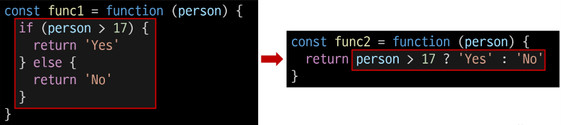

# Basic syntax of JavaScript

## 1. 변수

### 식별자(변수명) 작성 규칙
- 반드시 문자, 달러($) 또는 밑줄(_)로 시작
- 대소문자를 구분
- 예약어 사용 불가 (for, if, function등)

- 카멜 케이스(camelCase)
  - 변수, 객체, 함수에 사용
- 파스칼 케이스(PascalCase)
  - 클래스, 생성자에 사용
- 대문자 스네이크 케이스(SNAKE_CASE)
  - 상수(constants)에 사용

### 변수 선언 키워드

#### let
- 블록 스코프(blcok scope)를 갖는 지역 변수를 선언
- 재할당 가능
- 재선언 불가능
- ES6에서 추가
- 

#### const
- 블록 스코프를 갖는 지역 변수를 선언
- 재할달 불가능
- 재선언 불가능
- ES6에서 추가
- 

### 블록 스코프(block scope)
- if, for, 함수 등의 중괄호 내부를 가리킴
- 블록 스코프를 가지는 변수는 블록 바깥에서 접근 불가능
- 

### 변수 선언 키워드 정리
- 기본적으로 const 사용을 권장
- **재할당이 필요한 변수는 let으로 변경해서 사용**

## 2. 데이터 타입

### 데이터 타입

#### 원시 자료형 (Primitive type)
- Number, String, Boolean, undefined, null
- 변수에 값이 직접 저장되는 자료형(불변, 값이 복사)
- 원시 자료형 예시
  - 변수에 할당될 때 값이 복사됨
  - 변수간에 서로 영향을 미치지 않음
- 

#### 참조 자료형 (Reference type)
- Objects(object, Array, Function)
- 객체의 주소가 저장되는 자료형(가변, 주소가 복사)
- 참조 자료형 예시
  - 객체를 생성하면 객체의 메모리 주소를 변수에 할당
  - 변수 간에 서로 영향을 미침
- 

### 원시 자료형
#### Number : 정수 또는 실수형 숫자를 표현하는 자료형
- 

#### String : 텍스트 데이터를 표현하는 자료형
- '+' 연산자를 사용해 문자열 끼리 결합
- 곱셉, 나눗셈, 뺄셈 불가능
- 

#### Template literals(템플릿 리터럴)
- 내장된  표현식을 허용하는 문자열 작성 방식
- Backtick(``)을 이용하며, 여러 줄에 걸쳐 문자열을 정의할 수도 있고 JavaScript의 변수를 문자열 안에 바로 연결할 수 있음
- 표현식은 '$'와 중괄호(${expression})로 표기
- ES6+ 부터 지원
- 

#### null과 undefined

##### null : 변수의 값이 없음을 의도적으로 표현할 때 사용
- 

##### undefined : 변수 선언 이후 직접 값을 할당하지 않으면 자동으로 할당됨
- 

#### Boolean (true / false)
- 조건문 또는 반복문에서 Boolean이 아닌 데이터 타입은 "자동 형변환 규칙"에 따라 true 또는 false로 변환됨
- 자동 형변환
- 

## 3. 연산자

### 할당 연산자
- 오른쪽에 있는 피연산자의 평가 결과를 왼쪽 피연산자에 할당하는 연산자
- 단축 연산자 지원
- 

### 증가 & 감소 연산자
- 증가 연산자 (++)
  - 피연산자를 증가(1을 더함)시키고 연산자의 위치에 따라 증가하기 전이나 후의 값을 반환
- 감소 연산자(--)
  - 피연산자를 감소(1을 뺌)시키고 연산자의 위치에 따라 감소하기 전이나 후의 값을 반환
- 
- += 또는 -=와 같이 더 명시적인 표현으로 작성 하는 것을 권장

### 비교 연산자
- 피연산자들(숫자, 문자, Boolean 등)을 비교하고 결과 값을 boolean으로 반환하는 연산자
- 

### 동등 연산자(==)
- 두 피연산자가 같은 값으로 평가되는지 비교 후 boolean 값을 반환
- 암묵적 타입 변환 통해 타입을 일치시킨 후 같은 값인지 비교
- 두 피연산자가 모두 객체일 경우 메모리의 같은 객체를 바라보는지 판별
- 

### 일치 연산자(===)
- 두 피연산자의 값과 타입이 모두 같은 경우 true를 반환
- 같은 객체를 가리키거나, 같은 타입이면서 같은 값인지를 비교
- 엄격한 비교가 이뤄지며 암묵적 타입 변환이 발생하지 않음
- 특수한 경우를 제외하고는 동등 연산자가 아닌 **일치 연산자 사용 권장**
- 

### 논리 연산자
- and연산 (&&)
- or 연산 (||)
- not 연산 (!)
- 단축 평가를 지원함
- 

## 4. 조건문

### if : 조건 표현식의 결과값을 boolean 타입으로 변환 후 참/거짓을 판단
- 

### 조건 (삼항) 연산자
- 세 개의 피연산자를 받는 유일한 연산자
- 앞에서부터 조건문, 물음표(?), 조건문이 참일 경우 실행할 표현식, 콜론(:), 조건문이 거짓일 경우 실행할 표현식이 배치
- 

## 5. 반복문

### while : 조건문이 참이면 문장을 계속해서 수행
- 

### for : 특정한 조건이 거짓으로 판별될 때까지 반복
- 

### for ...in : 객체의 열거 가능한 속성(property)에 대해 반복
- 
- 

### for ...of : 반복 가능한 객체(배열, 문자열 등)에 대해 반복
- 
- 

### 배열 반복과 for...in
