# Controlling event

## 1. 이벤트

### 개요

**웹에서의 이벤트**
- 버튼을 클릭했을 때 팝업 창이 출력되는 것
- 마우스 커서의 위치에 따라 드래그 앤 드롭하는 것
- 사용자의 키보드 입력 값에 따라 새로운 요소를 생성하는 것
- 일상에서의 이벤트처럼 웹에서도 이벤트를 통해 특정 동작을 수행한다.

### Event

**event**
- 무언가 일어났다는 신호, 사건
- 모든 DOM 요소는 이러한 event를 만들어 냄

**event object**
- DOM에서 이벤트가 발생했을 때 생성되는 객체
- 이벤트 종류
  - mouse, input, keyboard, touch ....
  - https:developer.mozilla.org/en-US/docs/Web/API/Event/

**DOM요소는 event를 받고 받은 event를 '처리'(event handler)할 수 있음**

### event handler

**event handler**
- 이벤트가 발생했을 때 실행되는 함수
- 사용자의 행동에 어떻게 반응할지를 JavaScript 코드로 표현한 것

**.addEventListener()**
- 대표적인 이벤트 핸들러 중 하나
- 특정 이벤트를 DOM 요소가 수신할 때마다 콜백 함수를 호출 
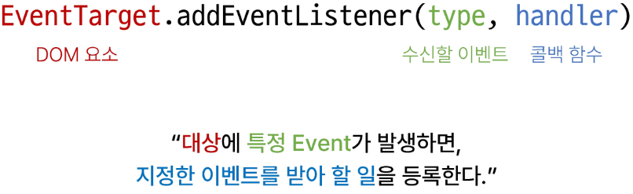

**.addEventListener(type,handler)**
- type
  - 수신할 이벤트 이름
  - 문자열로 작성 (ex. 'click')

- handler
  - 발생한 이벤트 객체를 수신하는 콜백 함수
  - 콜백 함수는 발생한 Event object를 유일한 매개변수로 받음

**addEventListener 활용**
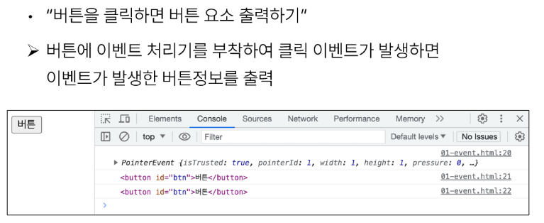
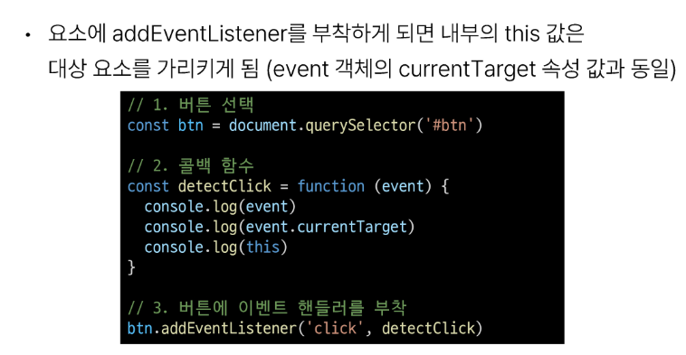

**addEventListener의 콜백 함수 특징**
- 발생한 이벤트를 나타내는 Event 객체를 유일한 매개변수로 받음
- 아무것도 반환하지 않음
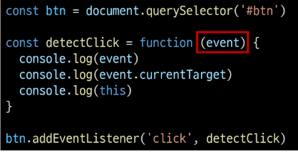

### 버블링

**버블링 개요**
- 핸들러는 form 요소에 할당되어 있지만 div나 p요소 같은 중첩된 요소를 클릭해도 동작함
- 왜 div나 p를 클릭했는데 form에 할당된 핸들러가 동작할까?
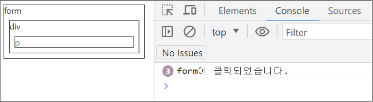
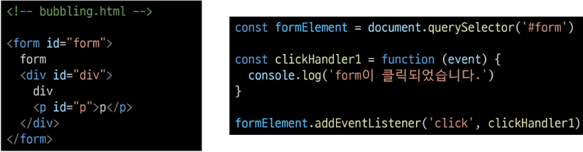

**버블링(Bubbling)**
- 한 요소에 이벤트가 발생하면, 이 요소에 할당된 핸들러가 동작하고, 이어서 부모 요소의 핸들러가 동작하는 현상
- 가장 최상단의 조상 요소(document)를 만날 때까지 이 과정이 반복되면서 요소 각각에 할당된 핸들러가 동작

**버블링 예시**
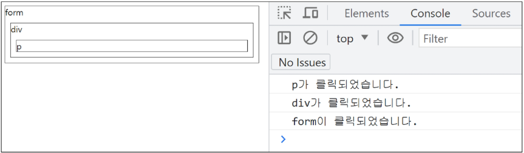
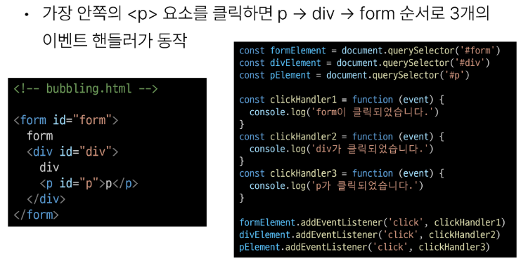

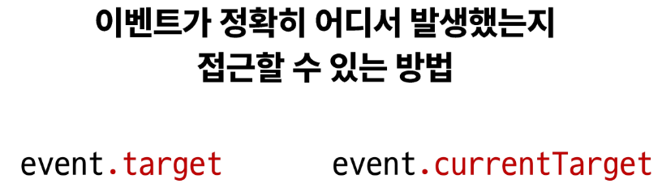

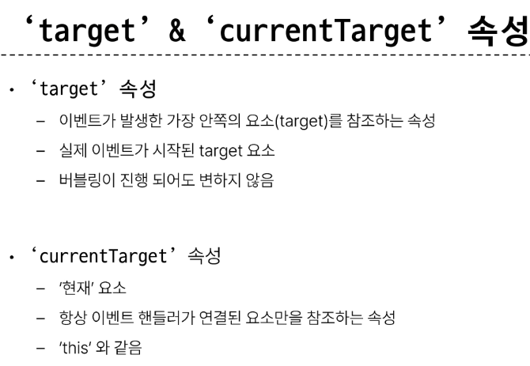

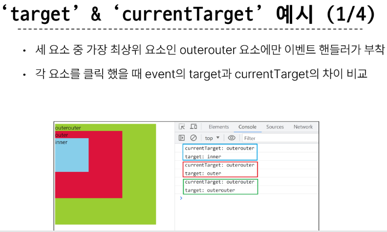
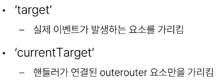
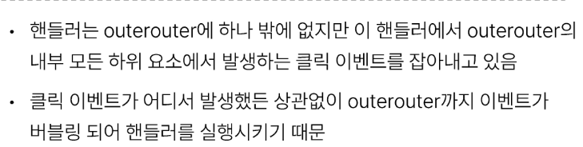

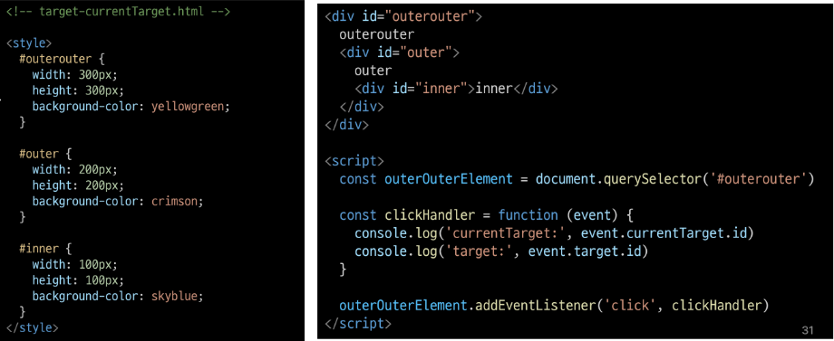

## 2. event handler 활용

**event handler 활용 실습**
1. 버튼을 클릭하면 숫자를 1씩 증가해서 출력하기
   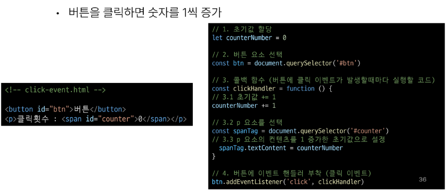

2. 사용자의 입력 값을 실시간으로 출력하기

   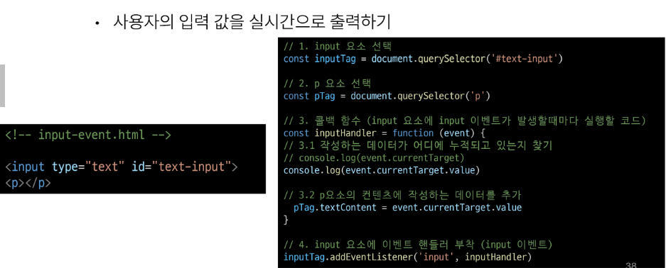

3. 사용자의 입력 값을 실시간으로 출력 + 버튼을 클릭하면 출력한 값의 CSS스타일 변경

    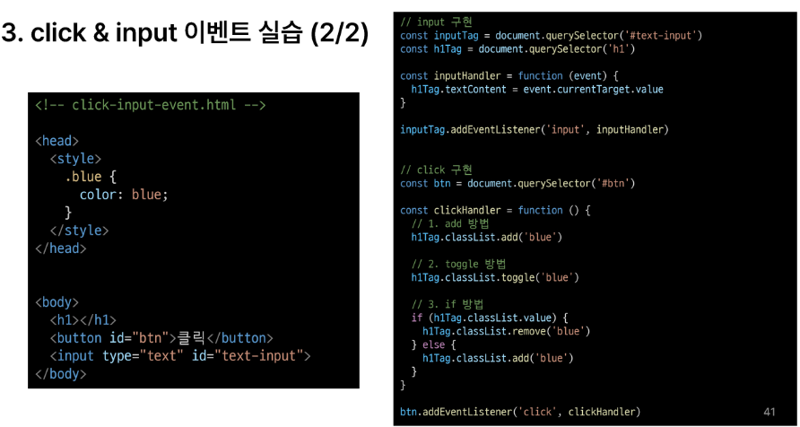

4. todo 프로그램 구현

    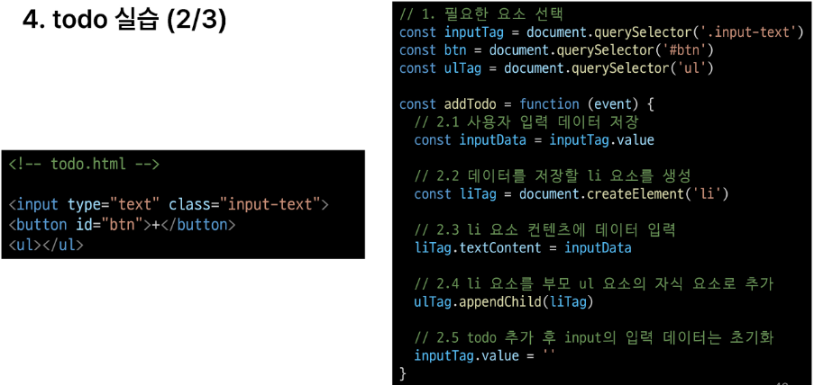
    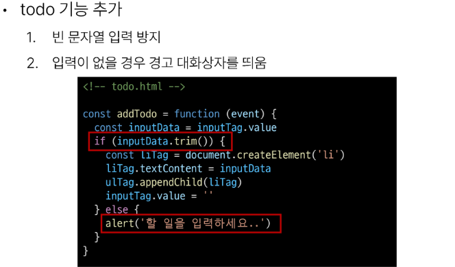

5. 로또 번호 생성기 구현

    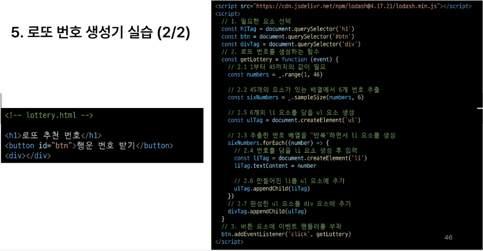

### 이벤트 기본 동작 취소

**.preventDefault()**
- 해당 이벤트에 대한 기본 동작을 실행하지 않도록 지정

- copy 이벤트 동작 취소
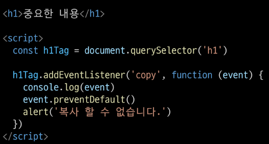

- form 제출 시 새로고침 동작 취소
 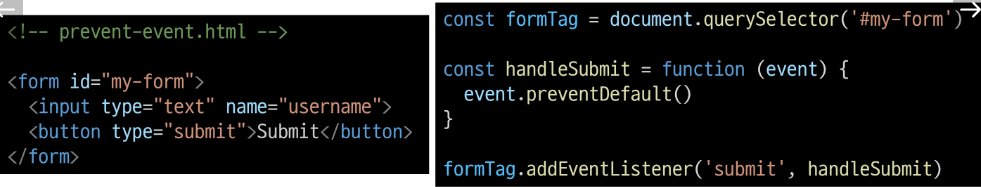

## 참고

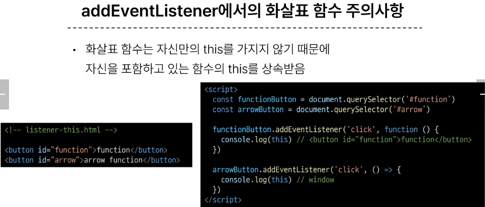