# Ajax with Django

## 1. Ajax와 서버

### 개요

**Ajax를 활용한 클라이언트 서버 간 동작**  
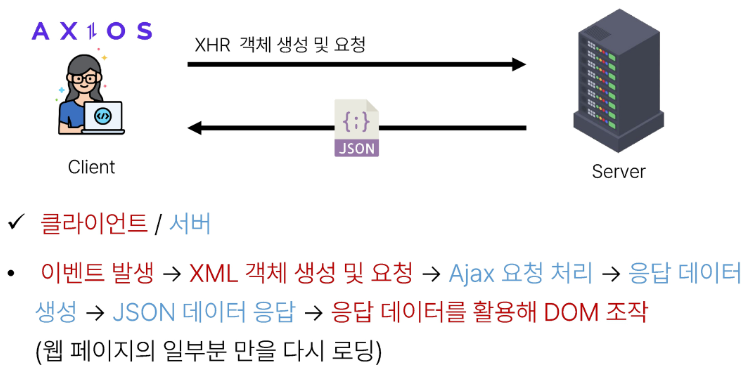

## 2. Ajax with follow

**사전준비**  

1. M:N 까지 진행한 Django 프로젝트 준비
2. 가상 환경 생성 및 활성화, 패키지 설치  

### Ajax 적용

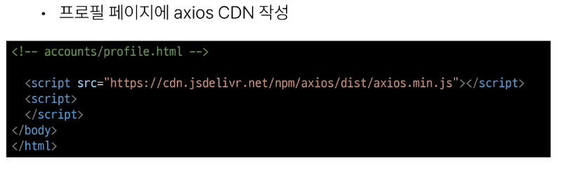  
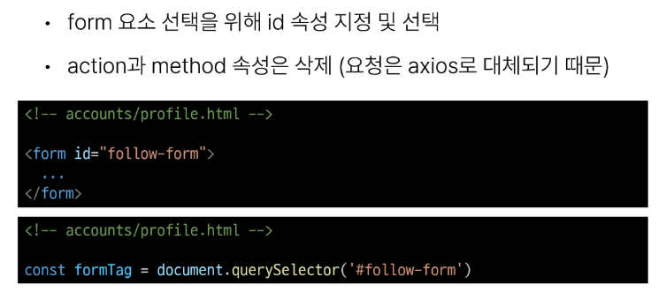  
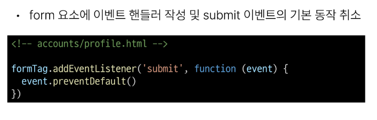  
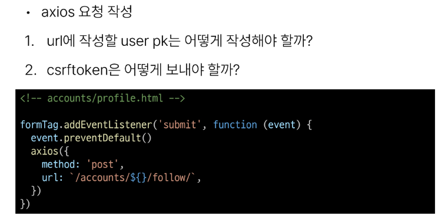  
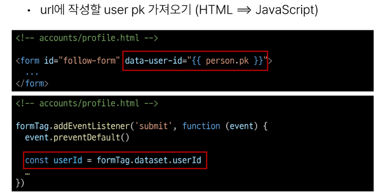  

**'data-*' 속성**

- 사용자 지정 데이터 특성을 만들어 임의의 데이터를 HTML과 DOM사이에서 교환 할 수 있는 방법  

**data-* 사용 예시**
      

- 모든 사용자 지정 데이터는 JS에서 **dataset** 속성을 통해 사용
- 주의사항
  1. 대소문자 여부에 상관없이 'xml' 문자로 시작 불가
  2. 세미콜론 포함 불가
  3. 대문자 포함 불가  

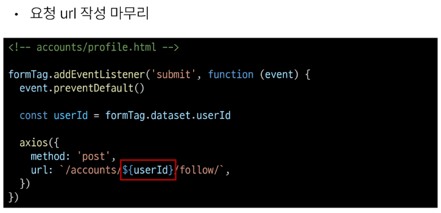  
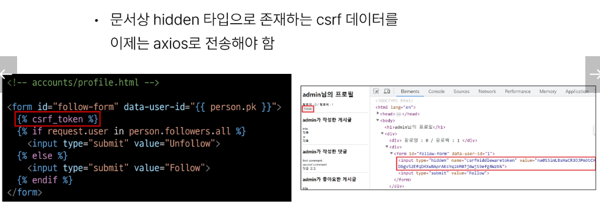  
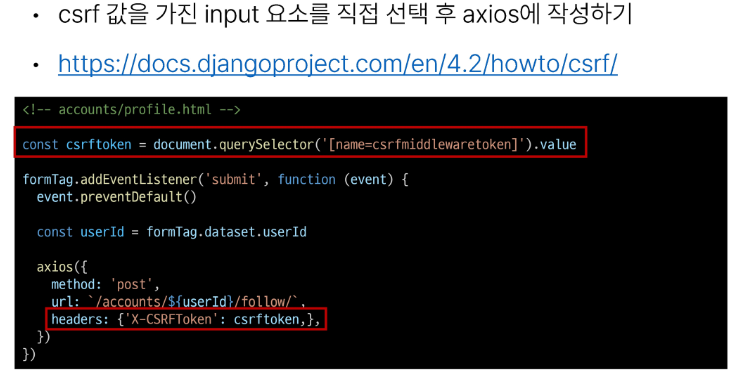  

팔로우 버튼을 토글하기 위해서는 현재 팔로우 상태인지 언팔로우 상태인지에 대한 상태 확인이 필요하다
 따라서 Django의 view 함수에서 팔로우 여부를 파악 할 수 있는 변수를 추가로 생성해 JSON 타입으로 응답해주어야함  

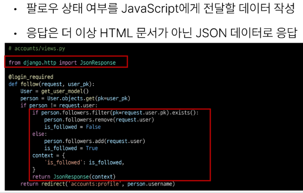  
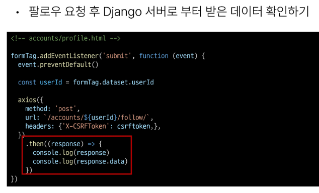  
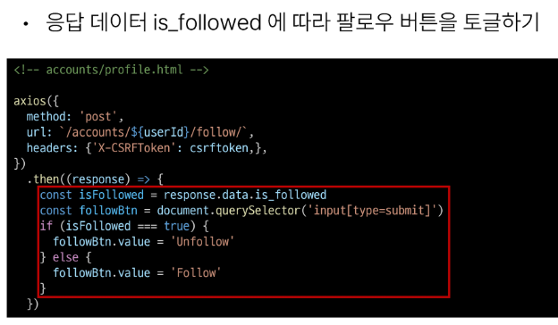  
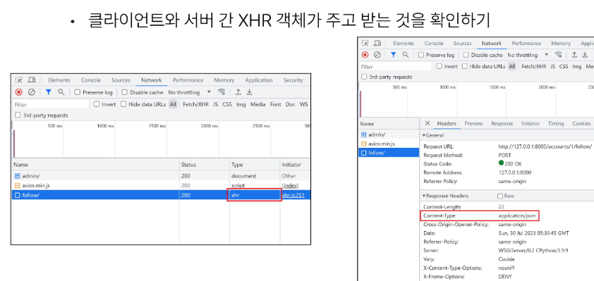  
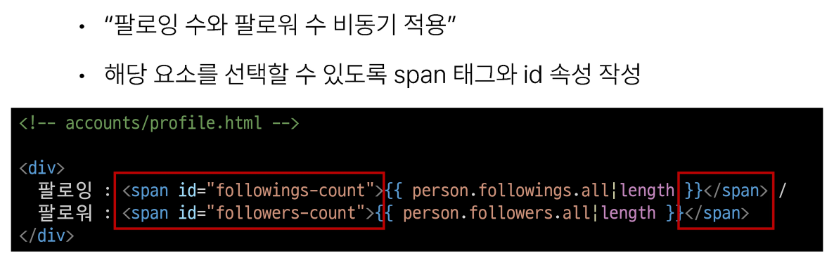  
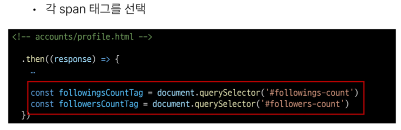  
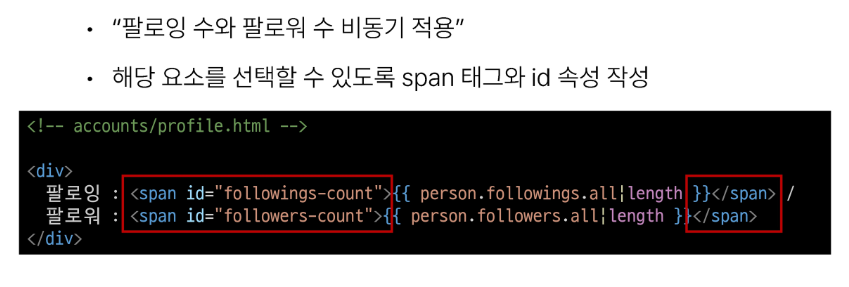  
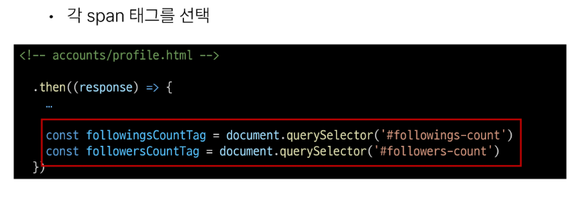  
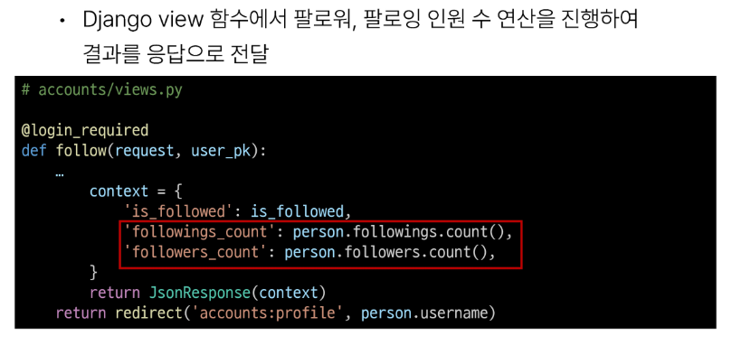  
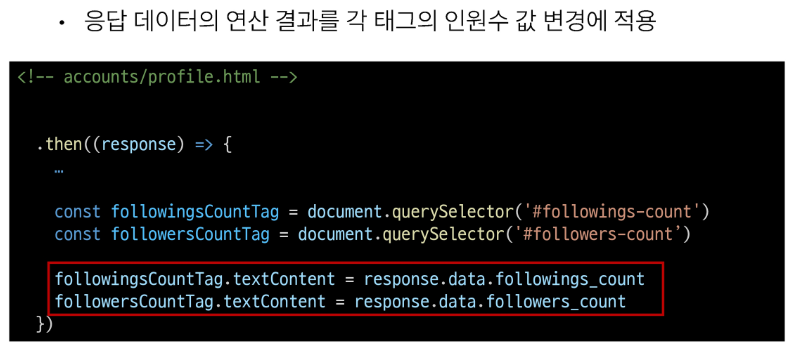  

## 3. Ajax with likes

### Ajax 좋아요 적용 시 유의사항

- Ajax 적용은 팔로우와 모두 동일
- 단 팔로우와 달리 좋아요 버튼은 한 페이지에 여러 개가 존재
  1. forEach()
  2. querySelectorAll()

#### 정리

**Bold : 클라이언트**
Normal : 서버

**이벤트 발생** -> **XML 객채 생성 및 요청** -> Ajax 요청 처리 -> 응답 데이터 생성 -> JSON 데이터 응답 => **응답 데이터를 활용해 DOM 조작** ( 웹페이지의 일부분 만을 다시 로딩)  

1. Ajax 적용을 위해 CDN 작성 필요

2. form 요소 선택을 위해 id 속성 지정 및 선택 (action과 method 속성은 axios로 대체)

3. form 요소에 이벤트 핸들러 작성 및 submit 이벤트 기본 동작 취소

4. axios 요청 작성
   
   1. url에 작성할 user pk 는 어떻게 작성해야하나?
   
   2. csrftoken은 어떻게 보내나

5. url에 작성할 user pk는 HTML => JS 을 가능하게 해주는 'data-*' 속성을 사용함
   
   data-* 속성은 사용장 지정 데이터 특성을 만들어 임의의 데이터를 HTML과 DOM 사이에서 교환할 수 있는 방법이다. 
   
   예)
   
   

   
   
   
   

6. const csrftoken = document.querySelector('[name=csrfmiddlewaretoken]').value

   

{'X-CSRFToken': csrftoken,}

7. 팔로우 버튼을 토글하기 위해서는 현재 팔로우 상태인지 언팔로우 상태인지에 대한 상태 확인이 필요함
   
   1. 따라서 Django의 view 함수에서 팔로우 여부를 파악 할 수 있는 변수를 추가로 생성해 JSON 타입으로 응답하기
   
   2. django.http의 JsonResponse import 하기
   
   3. return JsonResponse(context)

