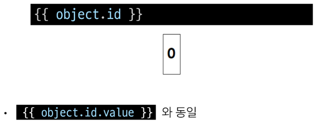

# Introduction of Vue

## 1. Front-end Development

### Client-side frameworks

**Front-end Development**

- 웹사이트와 웹 애플리케이션의 사용자 인터페이스(UI)와 사용자 경험(UX)을 만들고 디자인하는 것

- HTML, CSS, JS 등을 활용하여 사용자가 직접 상호작용하는 부분을 개발  

**Client-side frameworks**

- 클라이언트 측에서 UI와 상호작용을 개발하기 위해 사용되는 JS 기반 프레임워크

**Client-side frameworks가 필요한 이유 1**

- **웹에서 하는 일이 많아졌다 (단순히 무언가를 읽는곳 -> 무언가를 하는 곳)**

- 사용자는 이제 웹에서 문서만을 읽는 것이 아닌 음악을 스트리밍하고, 영화를 보고, 원거리에 있는 사람들과 텍스트 및 영상 채팅을 통해 즉시 통신하고 있음

- 이처럼 현대적이고 복잡한 대화형 웹 사이트를 "웹 애플리케이션"이라 부름

- JS 기반의 Client-side frameworks의 출현으로 매우 동적인 대화형 애플리케이션을 훨씬 더 쉽게 구축할 수 있게 됨

**Client-side frameworks가 필요한 이유2**

- **웹에서 하는 일이 많아졌다(다루는 데이터가 많아졌다)**  
    

  

### SPA

**Single Page Application(SPA)**

- 페이지 한 개로 구성된 웹 애플리케이션  
    
1. 서버로부터 필요한 모든 정적 HTML을 처음에 한번 가져옴
2. 브라우저가 페이지를 로드하면 Vue 프레임워크는 각 HTML 요소에 적절한 JS 코드를 실행(이벤트에 응답, 데이터 요청 후 UI 업데이트 등)
   - ex) 페이지 간 이동 시, 페이지 갱신에 필요한 데이터만을 JSON으로 전달받아 페이지 일부 갱신
   - Google Maps, Instagram 등의 서비스에서 갱신 시 새로고침이 없는 이유

**SPA의 CSR 방식**

- 웹 애플리케이션의 초기 로딩 후 새로운 페이지 요청 없이 동적으로 화면을 갱신하며 사용자와 상호작용하는 웹 애플리케이션  

**Client-side Rendering(CSR)**

- 클라이언트에서 화면을 렌더링 하는 방식
1. 브라우저는 페이지에 필요한 최소한의 HTML 페이지와 JS를 다운로드
2. 그런 다음 JS를 사용하여 DOM을 업데이트하고 페이지를 렌더링  
     

**Client-side Rendering 장점**

1. 빠른 속도
   - 페이지의 일부를 다시 렌더링할 수 있으므로 동일한 웹 사이트의 다른 페이지로 이동하는 것이 일반적으로 더 빠름
   - 서버로 전송되는 데이터의 양을 최소화  
2. 사용자 경험
   - 새로고침이 발생하지 않아 네이티브 앱과 유사한 사용자 경험을 제공  
3. Front-end와 Back-end의 명확한 분리
   - Front-end는 UI렌더링 및 사용자 상호 작용 처리를 담당, Back-end는 데이터 및 API 제공을 담당
   - 대규모 애플리케이션을 더 쉽게 개발하고 유지 관리 가능  

**Client-side Rendering 단점**

1. 초기 구동속도가 느림
   
   - 전체 페이지를 보기 전에 약간의 지연을 느낄 수 있음  
   - JS가 다운로드, 구문 분석 및 실행될 때까지 페이지가 완전히 렌더링 되지 않기 때문  

2. SEO(검색 엔진 최적화)문제
   
   - 페이지를 나중에 그려 나가는 것이기 때문에 검색에 잘 노출되지 않을 수 있음

## 2. Vue

### What is Vue

**What is Vue?**

- 사용자 인터페이스(UI)를 구축하기 위한 JS 프레임워크
- 2023년 기준 최신버전은 Vue3임으로 Vue2 문서에 접속하지 않도록 주의  

**Vue를 학습하는 이유**

1. 쉬운 학습 곡선 및 간편한 문법
   - 새로운 개발자들도 빠르게 학습할 수 있음  
2. 반응성 시스템
   - 데이터 변경에 따라 자동으로 화면이 업데이트되는 기능을 제공  
3. 모듈화 및 유연한 구조
   - 애플리케이션을 컴포넌트 조각으로 나눌 수 있음
   - 코드의 재사용성을 높이고 유지보수를 용이하게 함  

**Vue의 2가지 핵심 기능**

1. 선언적 렌더링(Declarative Rendering)
   - HTML을 확장하는 템플릿 구문을 사용하여 HTML이 JS데이터를 기반으로 어떻게 보이는지 설명할 수 있음
2. 반응형(Reactivity)
   - JS 상태 변경사항을 자동으로 추적하고 변경사항이 발생할 때 DOM을 효율적으로 업데이트

### Vue Tutorial

**Vue를 사용하는 방법**

1. 'CDN' 방식
2. 'NPM' 설치 방식
   - CDN 방식 이후 진행

**첫번째 Vue 작성하기**  

1. CDN 및 Application instance 작성  
     

2. app.mount()  
     

**ref()**

- 반응형 상태(데이터)를 선언하는 함수(Declaring Reactive State)  
- 반응형을 가지는 참조 변수를 만드는 것 (ref === reactive reference)  
    
    

**Vue 기본 구조**  
  

**템플릿 렌더링**  
  
  

**Event Listener in Vue**

- 'v-on' directive를 사용하여 DOM 이벤트를 수신할 수 있음  
- 함수 내에서 refs를 변경하여 구성 요소 상태 업데이트  
    

### 참고

**Ref Unwrap 주의사항**

- 템플릿에서의 unwrap은 ref가 최상위 속성인 경우에만 적용가능

- 아래 표현식은 어떻게 출력될까?  
    

- 출력: [object Object]1

- object는 최상위 속성이지만 object.id는 그렇지 않음

- 표현식을 평가할 때 object.id가 unwrap 되지 않고 ref 객체로 남아 있기 때문  

- **이 문제를 해결하기 위해서는 'id를 최상위 속성으로 분해'해야 함**  
  

- 출력 : 1  

- 단, ref 가 {{}}의 최종 평가 값인 경우는 unwrap 가능  
    

**Why Refs?**

- 일반 변수 대신 굳이 .value가 포함된 ref가 필요한 이유는?
- Vue는 템플릿에서 ref를 사용하고 나중에 ref의 값을 변경하면 자동으로 변경 사항을 감지하고 그에 따라 DOM을 업데이트 함 ("의존성 추적 기반의 반응형 시스템")
- Vue는 렌더링 중에 사용된 모든 ref를 추적하며, 나중에 ref가 변경되면 이를 추적하는 구성 요소에 대해 다시 렌더링
- JS에서는 일반 변수의 접근 또는 변형을 감지할 방법이 없기 때문

**CSR & SSR**

- CSR과 SSR은 흑과 백이 아님
  - 내 서비스에 적합한 렌더링 방식을 적절히 활용할 수 있어야함  
- SPA 서비스에서도 SSR을 지원하는 Framework가 발전하고 있음
  - Vue     : Nuxt.js
  - React   : Next.js
  - Angular : Universal