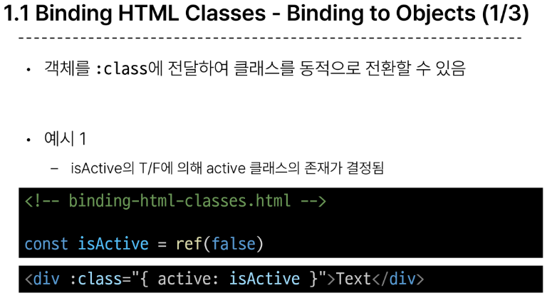
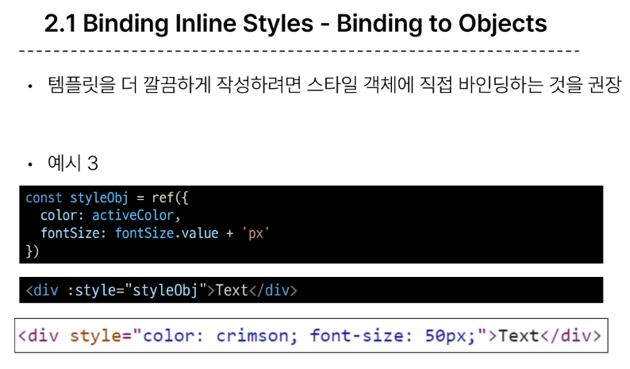

# Basic Syntax - 01

## 1. Template Syntax

### 개요

**Template Syntax**

- DOM을 기본 구성 요소 인스턴스의 데이터에 선언적(Vue Instance와 DOM을 연결)으로 바인딩할 수 있는 HTML 기반 템플릿(확장된 문법 제공) 구문을 사용  

  

**Template Syntax**

1. **Text Interpolation**  
   
   
   - 데이터 바인딩의 가장 기본적인 형태
   
   - 이중 중괄호 구문 (콧수염 구문)을 사용
   
   - 콧수염 구문은 해당 구성 요소 인스턴스의 msg 속성 값으로 대체
   
   - msg 속성이 변경될 때마다 업데이트 됨  

2. **Raw HTML**
   
   - 콧수염 구문은 데이터를 일반 텍스트로 해석하기 때문에 실제 HTML을 출력하려면 v-html을 사용해야함

3. **Attribute Bindings**  
   
   - 콧수염 구문은 HTML 속성 내에서 사용할 수 없기 때문에 v-bind를 사용
   - HTML의 id 속성 값을 vue의 dynamicId 속성과 동기화 되도록 함
   - 바인딩 값이 null이나 undefind인 경우 렌더링 요소에서 제거됨  

4. **JavaScript Expressions**  
     
   - Vue는 모든 데이터 바인딩 내에서 JS 표현식의 모든 기능을 지원
   - Vue 템플릿에서 JS 표현식을 사용할 수 있는 위치
      - 콧수염 구문 내부
      - 모든 directive의 속성 값(v-로 시작하는 특수 속성)  

  
**Expressions 주의사항**
- 각 바인딩에는 하나의 단일 표현식만 포함될 수 있음
   - 표현식은 값으로 평가할 수 있는 코드 조각(return 뒤에 사용할 수 있는 코드여야 함)  
- 작동하지 않는 경우  
   
  

### Directive  
**Directive**
- 'v' 접두사가 있는 특수 속성  

**Directive 특징**
- Directive의 속성 값은 단일 JS 표현식이어야 함 (v-for, v-on 제외)
- 표현식 값이 변경될 때 DOM에 반응적으로 업데이트를 적용
- 예시
   - v-if는 seen 표현식 값의 T/F를 기반으로 
 요소를 제거/삽입  
     
  
**Directive 전체 구문**  
     

**Directive - Arguments**
- 일부 directive는 directive 뒤에 콜론(:)으로 표시되는 인자를 사용할 수 있다.
- 아래 예시의 href는 HTML a 요소의 href 속성 값을 myUrl 값에 바인딩 하도록 하는 v-bind의 인자  

      

- 아래 예시의 click은 이벤트 수신할 이벤트 이름을 작성하는 v-on의 인자  
     

**Directive - Modifiers**
- . (dot)로 표시되는 특수 접미사로, directive가 특별한 방식으로 바인딩되어야 함을 나타냄
- 예를 들어 .prevent는 발생한 이벤트에서 event.preventDefault()를 호출하도록 v-on에 지시하는 modifier  
     

**Built-in Directives**
- v-text
- v-show
- v-if
- v-for
- https://vuejs.org/api/built-in-directives.html/

  
  

## 2. Dynamically data binding  

**v-bind**
- 하나 이상의 속성 또는 컴포넌트 데이터를 표현식에 동적으로 바인딩  

**v-bind 사용처**
1. Attribute Bindings
2. Class and Style Bindings
  

**Attribute Bindings**
  
  

**Attribute Bindings 예시**
     
- 결과  
  

### Class and Style Bindings  

**Class and Style Bindings**
- 클래스와 스타일은 모두 속성이므로 v-bind를 사용하여 다른 속성과 마찬가지로 동적으로 문자열 값을 할당할 수 있음  

- 그러나 단순히 문자열 연결을 사용하여 이러한 값을 생성하는 것은 번거롭고 오류가 발생하기가 쉬움  

- Vue는 클래스 및 스타일과 함께 v-bind를 사용할 때 객체 또는 배열을 활용한 개선 사항을 제공

**Class and Style Bindings가 가능한 경우**  
1. **Binding HTML Classes**
   1. Binding to Objects
   2. Binding to Arrays
2. **Binding Inline Styles**
   1. Binding to Objects
   2. Binding to Array
  
  
  

  
  
  

  
  
  
  
  
  
  

**v-bind 종합**
- https://vuejs.org/api/built-in-directives.html#v-bind/

## 3. Event Handling

**v-on**
- DOM 요소에 이벤트 리스너를 연결 및 수신  

**v-on 구성**

### 1. Inline handlers
- Inline handlers는 주로 간단한 상황에 사용

   

### 2. Method Handlers
- Inline handlers 로는 불가능한 대부분의 상황에서 사용  

     

- Method Handlers는 이를 트리거하는 기본 DOM Event 객체를 자동으로 수신  

   

### Inline Handlers에서 메서드 호출
- 메서드 이름에 직접 바인딩하는 대신 Inline Handlers에서 메서드를 호출할 수도 있음

- 이렇게 하면 기본 이벤트 대신  사용자 지정 인자를 전달할 수 있음

   
  

### Inline Handlers에서의 event 인자에 접근하기
- Inline Handlers에서 원래 DOM 이벤트에 접근하기
- $event 변수를 사용해 메서드에 전달  

   

### Event Modifiers
- Vue는 v-on에 대한 Event Modifiers를 제공해 event.preventDefault()와 같은 구문을 메서드에서 작성하지 않도록 함
- stop, prevent, self 등 다양한 modifiers를 제공
- 메서드는 DOM 이벤트에 대한 처리보다는 데이터에 관한 논리를 작성하는 것에 집중할 것  

     

### Key Modifiers
- Vue는 키보드 이벤트를 수신할 때 특정 키에 관한 별도 modifiers를 사용할 수 있음
- 예시
   - key가 Enter 일 때만 onSubmit 이벤트를 호출하기  

   

###  V-on 종합
- https://vuejs.org/api/built-in-directives.html#v-on/

## 4. Form Input Bindings

### Form Input Bindings
- form을 처리할 때 사용자가 input에 입력하는 값을 실시간으로 JS 상태에 동기화해야 하는 경우(양방향 바인딩)  
- 양방향 바인딩 방법
   1. v-bind와 v-on을 함께 사용
   2. v-model 사용
  

### v-model
- form input 요소 또는 컴포넌트에서 양방향 바인딩을 만듦  

  

### v-model 활용

#### v-modle과 다양한 입력(input) 양식
-  v-model은 단순 text input 뿐만 아니라 Checkbox, Radio, Select 등 다양한 타입의 사용자 입력 방식과 함께 사용 가능  

  

#### v-model 종합
- https://vuejs.org/api/built-in-directives.html#v-model