# Basic Syntax - 02

## 1. Computed Property

### **Computed**

### computed()
- 계산된 속성을 정의하는 함수
- 미리 계산된 속성을 사용하여 템플릿에서 표현식을 단순하게 하고 불필요한 반복 연산을 줄임

### computed 예시
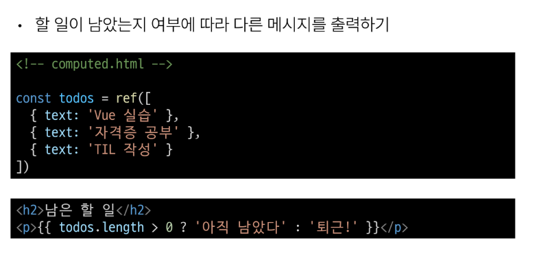  

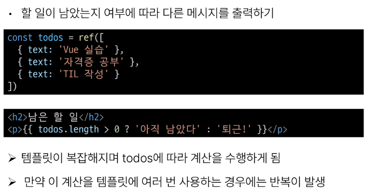  

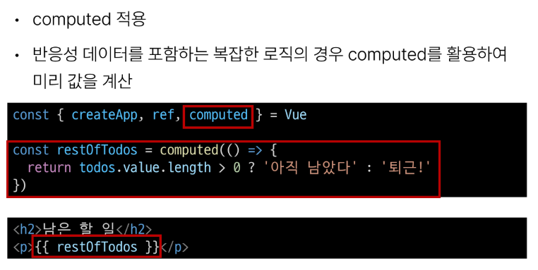

**computed 특징**

- 반환되는 값은 computed ref이며 일반 refs와 유사하게 계산된 결과를 . value로 참조 할 수 있음 (템플릿에서는 .value 생략 가능)

- computed 속성은 의존된 반응형 데이터를 **자동으로 추적**

- 의존하는 데이터가 변경될 때만 재평가
    - restOfTodos의 계사은 todos에 의존하고 있음
    - 따라서 **todos 가 변경될 때만 restOfTodos가 업데이트** 됨
  

### **Computed vs Methods**

### computed와 동일한 로직을 처리할 수 있는 method
- computed 속성 대신 method로도 동일한 기능을 정의할 수 있음
- 두 가지 접근 방식은 실제로 완전히 동일  

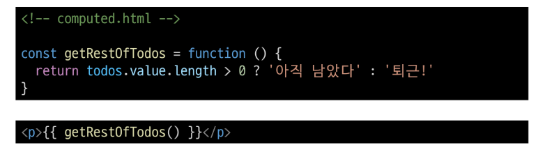
  

### **computed와 method 차이**
- computed 속성은 **의존된 반응형 데이터를 기반으로 캐시(cached)된다**
- 즉, 의존형 반응형 데이터가 변경되지 않는 한 이미 계산된 결과에 대한 여러 참조는 다시 평가할 필요 없이 이전에 계산된 결과를 즉시 반환.
- 반면, method 호출은 다시 렌더링일 발생할 때마다 항상 함수를 실행  
  
### **Cache(캐시)**
- 데이터나 결과를 일시적으로 저장해두는 임시 저장소
- 이후에 같은 데이터나 결과를 다시 계산하지 않고 빠르게 접근할 수 있도록 함  

### **computed와 method의 적절한 사용처**
- computed
    - 의존하는 데이터에 따라 결과가 바뀌는 계산된 속성을 만들 때 유용
    - 동일한 의존성을 가진 여러 곳에서 사용할 때 계산 결과를 캐싱하여 중복 계산 방지

- method
    - 단순히 특정 동작을 수행하는 함수를 정의할 때 사용
    - 데이터에 의존하는지 여부와 관계없이 항상 동일한 결과를 반환하는 함수

### **method와 computed 정리**
- computed
    - 의존된 데이터가 변경되면 자동으로 업데이트
- method
    - 호출해야만 실행됨
- 무조건 computed만 사용하는 것이 아니라 사용 목적과 상황에 맞게 적절히 조합하여 사용

## 2. Conditional Rendering

### **v-if**
- 표현식 값의 T/F를 기반으로 요소를 조건부로 렌더링  

### **v-if 예시**
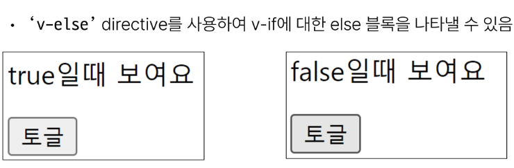  

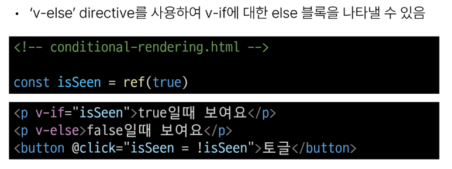  

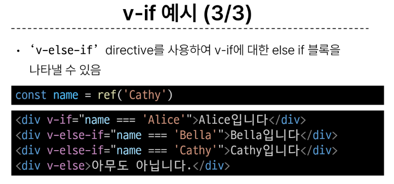  

### **여러 요소에 대한 v-if 적용**
- v-if는 directive이기 때문에 단일 요소에만 연결 가능
- 이 경우 template 요소에 v-if를 사용하여 하나 이상의 요소에 대해 적용 할 수 있음(v-eles, v-eles-if 모두 적용 가능)  

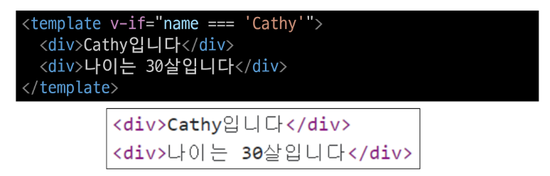  

### template element
- 페이지가 로드 될 때 렌더링 되지 않지만 JS를 사용하여 나중에 문서에서 사용할 수 있도록 하는 HTML을 보유하기 위한 메커니즘
- 보이지 않는 wrapper 역할

### **v-show**

### v-show
- 표현식 값의 T/F를 기반으로 요소의 가시성을 전환

### v-show 예시  

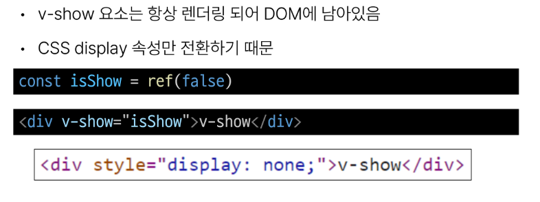

### **v-if vs v-show**

- v-if(Cheap initial load, expensive toggle)
    - 초기 조건이 false인 경우 아무 작업도 수행하지 않음
    - 토글 비용이 높음
- v-show(Expensive initial load, cheap toggle)
    - 초기 조건에 관계 없이 항상 렌더링
    - 초기 렌더링 비용이 더 높음

- 따라서 무언가를 매우 자주 전환해야 하는 경우에는 v-show를, 
실행중에 조건이 변경되지 않는 경우에는 v-if를 권장

## 3. List Rendering

### **v-for**
- 소스 데이터(Array, Object, number, string, iterable)를 기반으로 요소 또는 템플릿 블록을 여러 번 렌더링  

### v-for 구조
- v-for는 alias in expression 형식의 특수 구문을 사용하여 반복되는 현재 요소에 대한 별칭(alias)을 제공  

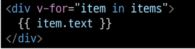

- 인덱스(객체에서는 키)에 대한 별칭을 지정할 수 있음  

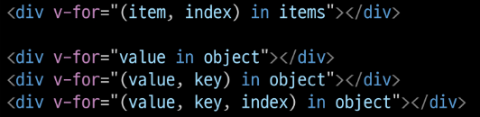

### v-for예시

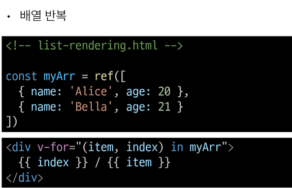  

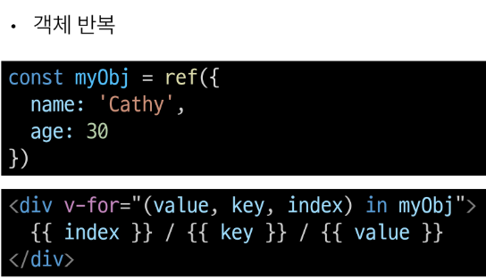  

### 여러 요소에 대한 v-for 적용
- template 요소에 v-for를 사용하여 하나 이상의 요소에 대해 반복 렌더링 할 수 있음  

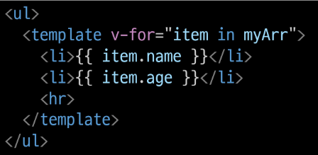  

### 중첩된 v-for
- 각 v-for 범위는 상위 범위에 접근 할 수 있음  

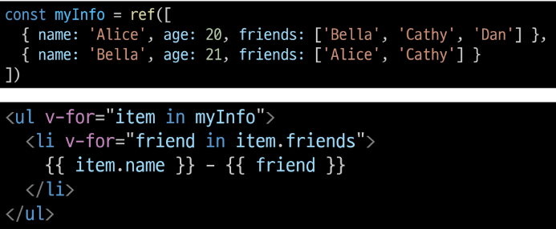

### **v-for with key**  

### 반드시 v-for와 key를 함께 사용한다
- 내부 컴포넌트의 상태를 일관되게 유지
- 데이터의 예측 가능한 행동을 유지 (Vue 내부 동작 관련)

### v-for와 key
- key는 반드시 각 요소에 대한 고유한 값을 나타낼 수 있는 식별자여야 함  

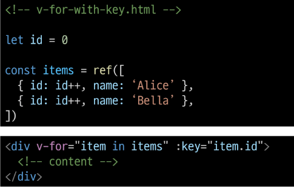

### **v-for with v-if**

### 동일 요소에 v-for와 v-if를 함께 사용하지 않는다
- 동일한 요소에서 v-if가 v-for보다 우선순위가 더 높기 때문
- v-if 조건은 v-for 범위의 변수에 접근할 수 없음

### v-for와 v-if 문제 상황 - 1  

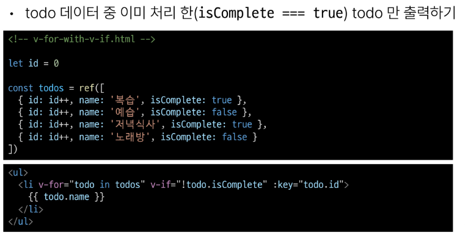

### v-for와 v-if 해결법 - 1  

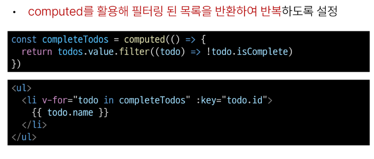

### v-for와 v-if 문제 상황 - 2  

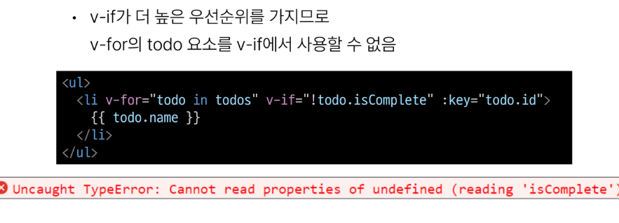

### v-for와 v-if 해결법 - 2  

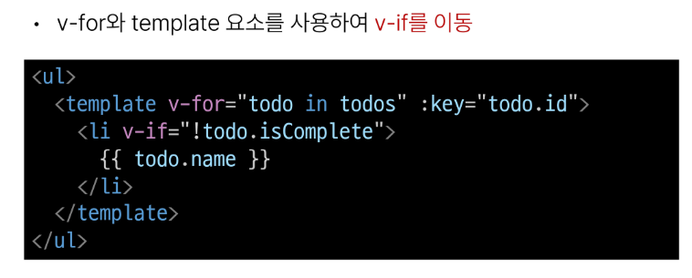

## 4. Watchers

### **Watchers**

### watch()
- 반응형 데이터를 감시하고, 감시하는 데이터가 변경되면 콜백 함수를 호출  

### watch 구조
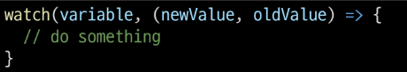

- variable
    - 감시하는 변수
- newValue
    - 감시하는 변수가 변화된 값
    - 콜백 함수의 첫번째 인자
- oldValue
    - 콜백 함수의 두번째 인자

### watch 예시  

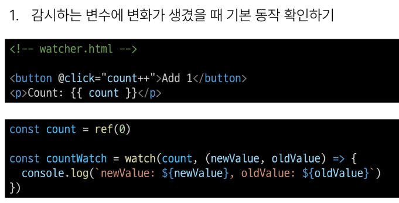  

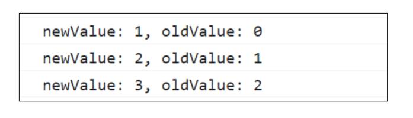  

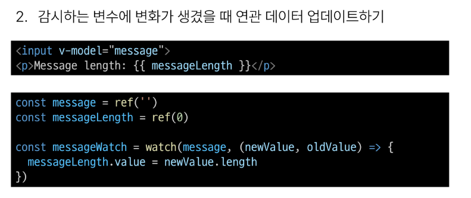  

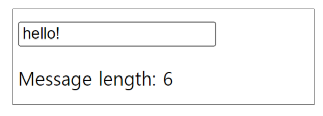  

### Computed와 Watchers 비교
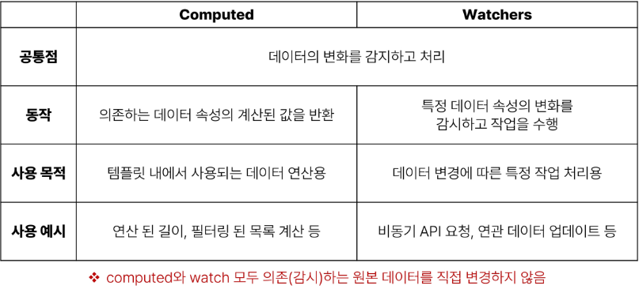

## 5. Lifecycle Hooks

### **Lifecycle Hooks**

### Lifecycle Hooks
- Vue 인스턴스의 생애주기 동안 특정 시점에 실행되는 함수
- 개발자가 특정 단계에서 의도하는 로직이 실행될 수 있도록 함

### Lifecycle Hooks 예시

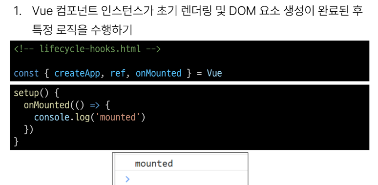  

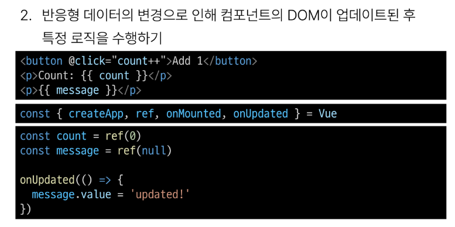
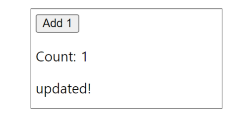  

### Lifecycle Hooks 특징
- Vue는 Lifecycle Hooks에 등록된 콜백 함수들을 인스턴스와 자동으로 연결함
- 이렇게 동작하려면 hooks 함수들은 반드시 동기적으로 작성되어야 함
- 인스턴스 생애 주기의 여러 단계에서 호출되는 다른 hooks도 있으며, 가장 일반적으로 사용되는 것은 onMounted, onUpdated, onUnmounted
- https://vuejs.org/api/composition-api-lifecycle.html/
 
### Lifecycle Hooks Diagram
- https://vuejs.org/guide/essentials/lifecycle.html#lifecycle-diagram/  

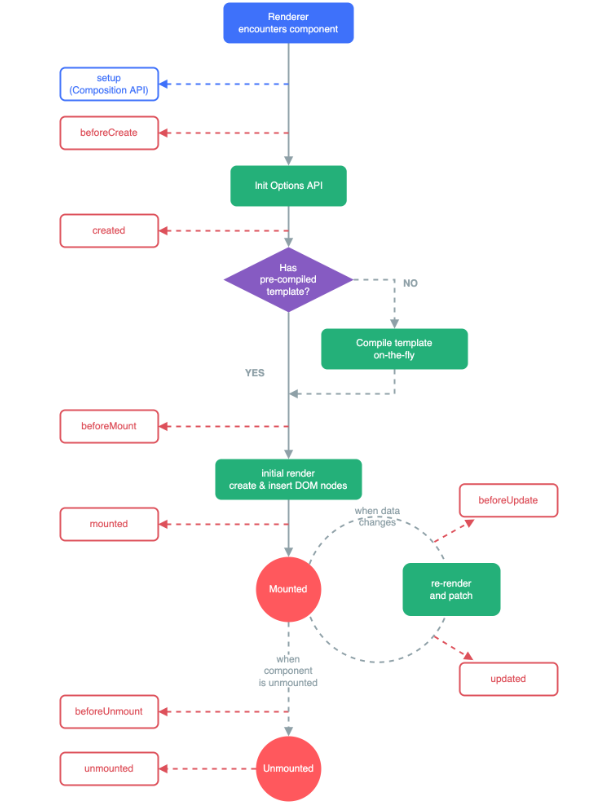

## 6. Vue Style Guide

### Vue Style Guide
- Vue의 스타일 가이드 규칙은 우선순위에 따라 4가지 범주로 나눔
- 규칙범주
    - 우선순위 A: 필수(Essential)
    - 우선순위 B: 적극권장(Strongly Recommended)
    - 우선순위 C: 권장(Recommended)
    - 우선순위 D: 주의 필요(Use with Caution)
- https:/vuejs.org/style-guide/

### 우선순위 별 특징
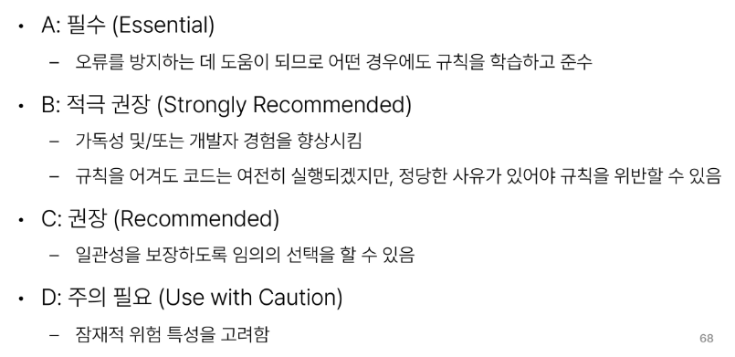

## 참고

### [주의] computed의 반환 값은 변경하지 말 것

- computed의 반환 값은 의존하는 데이터의 파생된 값
- 일종의 snapshot이며 의존하는 데이터가 변경될 때 마다 새 snapshot이 생성됨
- snapshot 을 변경하는 것은 의미가 없으므로 계산된 반환 값은 읽기 전용으로 취급되어야 하며 변경되어서는 안됨
- 대신 새 값을 얻기 위해서는 의존하는 데이터를 업데이트 해야함

### [주의] computed 사용 시 원본 배열 변경하지 말 것
- computed에서 reverse() 및 sort() 사용시 원본배열을 변경하기 때문에 복사본을 만들어 진행 해야함
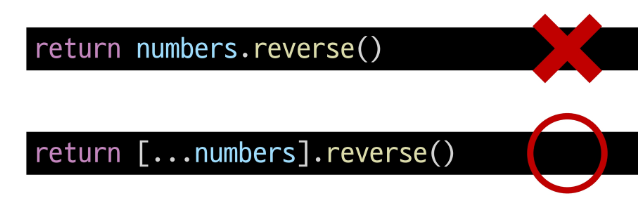  

### [주의] 배열의 인덱스를 v-for의 key로 사용하지 말 것
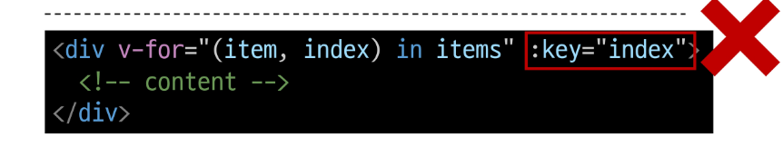
- 인덱스는 식별자가 아닌 배열의 항목 위치만 나타내기 때문에 Vue가 DOM을 변경 할 때 (끝이 아닌 위치에 새 항목이 배열에 삽입되면) 여러 컴포넌트간 데이터 공유 시 문제 발생
- 직접 고유한 값을 만들어내는 메서드를 만들거나 외부 라이브러리 등을 활용하는 등 식별자 역할을 할 수 있는 값을 만들어 사용

### v-for와 배열 - "배열 변경 감지"

- 수정 메서드 (원본 배열 수정)
    - Vue는 반응형 배열의 변경 메소드가 호출 되는 것을 감지하여, 필요한 업데이트를 발생시킴
    - push(), pop(), shift(), unshift(), splice(), sort(), reverse()

- 배열 교체
    - 원본 배열을 수정하지 않고 항상 새 배열을 반환
    - filter(), concat(), slice()

### v-for와 배열 - "필터링/정렬 결과 표시"

- 원본 데이터를 수정하거나 교체하지 않고 필터링 되거나 정렬된 결과를 표시
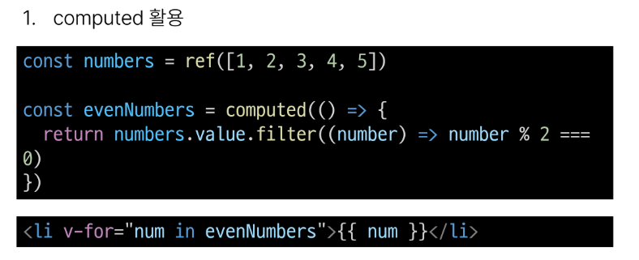  

    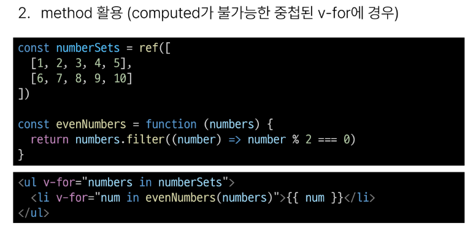