# Single-File Components

## 1. Single-File Components

### **Component**

### Component
- 재사용 가능한 코드 블록

### Component 특징
- UI를 독립적이고 재사용 가능한 일부분으로 분할하고 각 부분을 개별적으로 다룰 수 있음
- 그러면 자연스럽게 앱은 중첩된 Component의 트리로 구성됨

### Component 예시
- 웹 서비스는 여러 개의 Component로 이루어져 있음
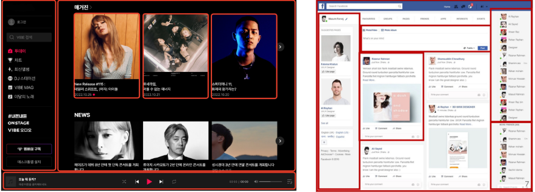

### **SFC**

### Single-File Components (SFC)
- 컴포넌트의 템플릿, 로직 및 스타일을 하나의 파일로 묶어낸 특수한 파일 형식(*.vue 파일)

### SFC 파일 예시
- Vue SFC는 HTML, CSS 및 JavaScript 3개를 하나로 합친 것
- template, script 및 style 블록은 하나의 파일에서 컴포넌트의 뷰, 로직 및 스타일을 캡슐화하고 배치  

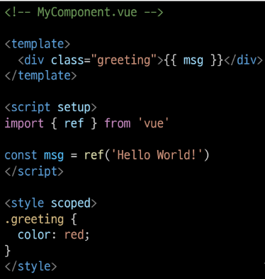  

### **SFC문법**

### SFC 문법 개요
- 각 *.vue 파일은 세 가지 유형의 최상위 언어 블록 template, script, style으로 구성됨
- 언어 블록의 작성 순서는 상관 없으나 일반적으로 template -> script -> style 순서로 작성  

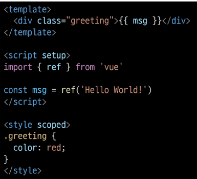  

### 언어 블록 - template
- 각 *.vue 파일은 최상위 template 블록을 하나만 포함할 수 있음

### 언어 블록 - script setup
- 각 *.vue 파일은 하나의 script setup 블록만 포함할 수 있음(일반 script 제외)
- 컴포넌트의 setup() 함수로 사용되며 컴포넌트의 각 인스턴스에 대해 실행  

### 언어 블록 - style scope
- *.vue 파일에는 여러 style 태그가 포함될 수 있음
- scoped가 지정되면 CSS는 현재 컴포넌트에만 적용

### 컴포넌트 사용하기
- https:/play.vuejs.org/ 에서 Vue 컴포넌트 코드 작성 및 미리보기
- Vue SFC는 컴파일러를 통해 컴파일 된 후 빌드 되어야 함
- 실제 프로젝트에서는 일반적으로 SFC 컴파일러를 Vite와 같은 공식 빌드 도구를 사용해 사용  

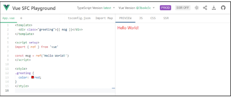  

## 2. SFC build tool (Vite)

### **Vite**

### Vite
- 프론트 엔드 개발 도구
- 빠른 개발 환경을 위한 빌드 도구와 개발 서버를 제공
- https://vitejs.dev/

### Vite 튜토리얼

  

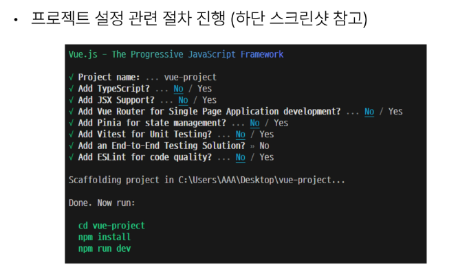  

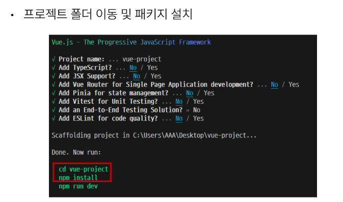  

  

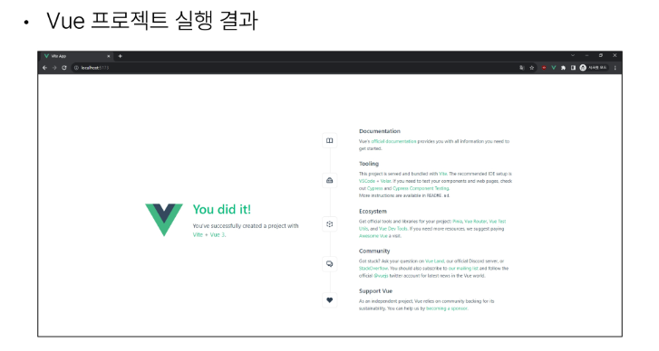

### **NPM**

### Node Package Manager (NPM)
- Node.js의 기본 패키지 관리자

### node.js
- Chrome V8 JavaScript 엔진을 기반으로 하는 Server-Side 실행 환경

### Node.js의 영향
- 기존에 브라우저 안에서만 동작할 수 있었던 JavaScript를 브라우저가 아닌 서버 측에서도 실행할 수 있게 함
    - 프론트엔드와 백엔드에서 동일한 언어로 개발할 수 있게 됨
- NPM을 활용해 수 많은 오픈 소스 패키지와 라이브러리를 제공하여 개발자들이 손쉽게 코드를 공유하고 재사용할 수 있게 함

### **Vite 프로젝트 구조**

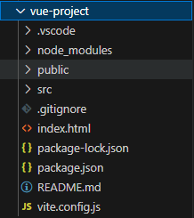  

### node_modules
- Node.js 프로젝트에서 사용되는 외부 패키지들이 저장되는 디렉토리
- 프로젝트의 의존성 모듈을 저장하고 관리하는 공간
- 프로젝트가 실행될 때 필요한 라이브러리와 패키지들을 포함
- .gitignore에 작성됨  

### package-lock.json
- 패키지들의 실제 설치 버전, 의존성 관계, 하위 패키지 등을 포함하여 패키지 설치에 필요한 모든 정보를 포함
- 패키지들의 정확한 버전을 보장하여, 여러 개발자가 협업하거나 서버 환경에서 일관성 있는 의존성을 유지하는데 도움을 줌
- npm install 명령을 통해 패키지를 설치할 때, 명시된 버전과 의존성을 기반으로 설치

### package.json
- 프로젝트의 메타 정보와 의존성 패키지 목록을 포함
- 프로젝트의 이름, 버전, 작성자, 라이선스 등과 같은 메타 정보를 정의
- package-lock.json과 함께 프로젝트의 의존성을 관리하고, 버전 충돌 및 일관성을 유지하는 역할

### public 디렉토리
- 주로 다음 정적 파일을 위치 시킴
    - 소스코드에서 참조되지 않는
    - 항상 같은 이름을 갖는
    - import 할 필요 없는

- 항상 root 절대 경로를 사용하여 참조
    - public/icon.png는 소스 코드에서 /icon.png로 참조 할 수 있음

- https://vitejs.dev/guide/assets.html#the-public-directory/

### src 디렉토리
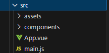  

- 프로젝트의 주요 소스 코드를 포함하는 곳
- 컴포넌트, 스타일, 라우팅 등 프로젝트의 핵심 코드를 관리

### src/asssets
  

- 프로젝트 내에서 사용되는 자원(이미지, 폰트, 스타일 시트 등)을 관리
- 컴포넌트 자체에서 참조하는 내부 파일을 저장하는데 사용
- 컴포넌트가 아닌 곳에서는 public 디렉토리에 위치한 파일을 사용

### src/components
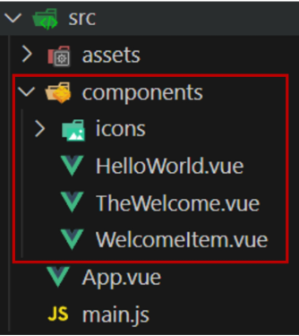  

- Vue 컴포넌트들을 작성하는 곳

### src/App.vue
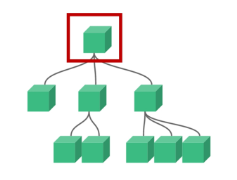  

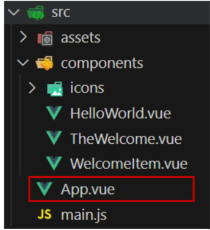  

- Vue 앱의 최상위 Root 컴포넌트
- 다른 하위 컴포넌트들을 포함
- 애플리케이션 전체의 레이아웃과 공통적인 요소를 정의

### src/main.js
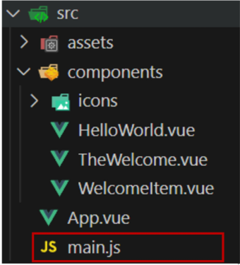  

- Vue 인스턴스를 생성하고, 애플리케이션을 초기화하는 역할
- 필요한 라이브러리를 import 하고 전역 설정을 수행

### index.html
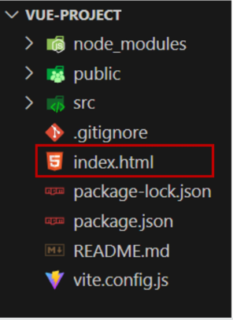  

- Vue 앱의 기본 HTML 파일
- 앱의 진입점 (entry point)
- Root 컴포넌트인 App.vue가 해당 페이지에 마운트(mount)됨
    - Vue 앱이 SPA 인 이유
- 필요한 스타일 시트, 스크립트 등의 외부 리소스를 로드 할 수 있음 (ex.bootstrap CDN)

### **모듈과 번들러**

### Module
- 프로그램을 구성하는 독립적인 코드 블록(*.js파일)
- 개발하는 애플리케이션의 크기가 커지고 복잡해지면서 파일 하나에 모든 기능을 담기가 어려워 짐
- 따라서 자연스럽게 파일을 여러개로 분리하여 관리 하게 되었고, 이때 분리된 파일 각각이 모듈(module) 즉, js 파일 하나가 하나의 모듈이 됨
- 그런데 모듈의 수가 많아지고 라이브러리 혹은 모듈 간의 의존성(연결성)이 깊어지면서 특정한 곳에서 발생한 문제가 어떤 모듈 간의 문제인지 파악하기 어려워 짐
- 복잡하고 깊은 모듈의 의존성 문제를 해결하기 위한 도구가 필요
    - Bundler!!

### Bundler
- 여러 모듈과 파일을 하나(혹은 여러 개)의 번들로 묶어 최적화하여 애플리케이션에서 사용할 수 있게 만들어주는 도구

### Bundler의 역할
- 의존성 관리, 코드 최적화, 리소스 관리 등
- Bundler가 하는 작업을 Bundling이라 함
- Vite는 Rollup이라는 Bundler를 사용하며 개발자가 별도로 기타 환경설정에 신경 쓰지 않도록 모두 설정해두고 있음

## 3. Vue Component

### **Component 활용**

### 컴포넌트 사용 2단계
1. 컴포넌트 파일 생성
2. 컴포넌트 등록(import)

### 사전준비
1. 초기에 생성된 모든 컴포넌트 삭제 (App.vue 제외)
2. App.vue 코드 초기화

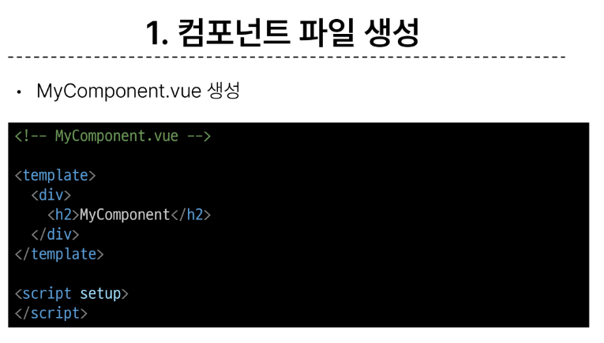  

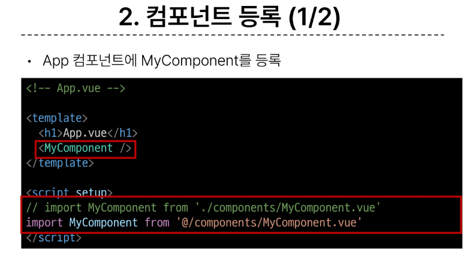
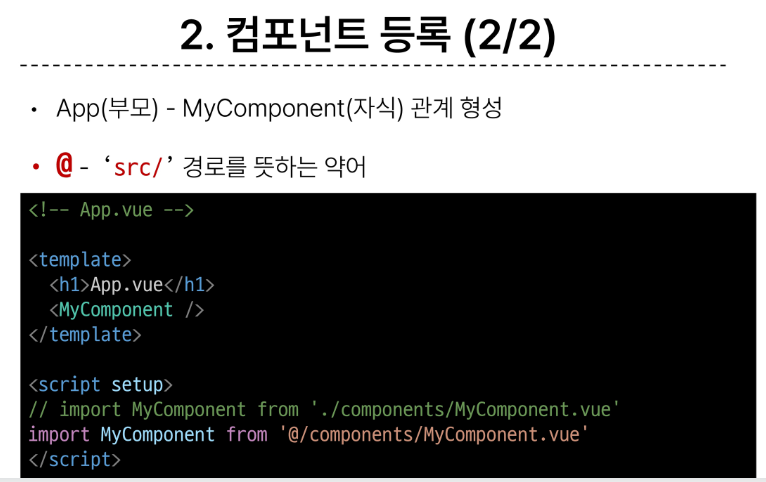

### 결과확인
- Vue dev tools를 사용해 컴포넌트 관계 형성 확인
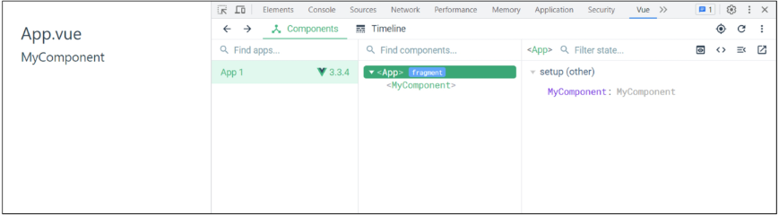  

### MyComponentItem 컴포넌트 등록 후 활용
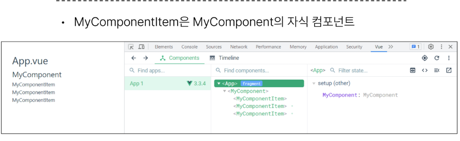
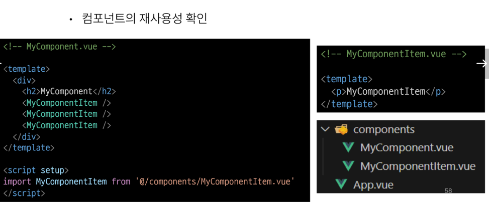

### Component 이름 관련 스타일 가이드
- https://vuejs.org/style-guide/rules-strongly-recommended.html/

## 4. 추가주제

### **Virtual DOM**

### Virtual DOM
- 가상의 DOM을 메모리에 저장하고 실제 DOM과 동기화하는 프로그래밍 개념
- 실제 DOM과의 변경 사항 비교를 통해 변경된 부분만 실제 DOM에 적용하는 방식
- 웹 애플리케이션의 성능을 향상시키기 위한 Vue의 내부 렌더링 기술
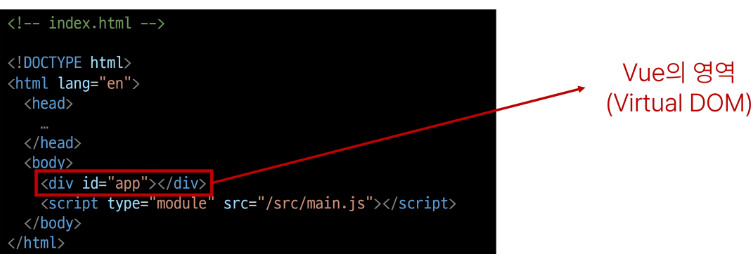

### 내부 렌더링 과정
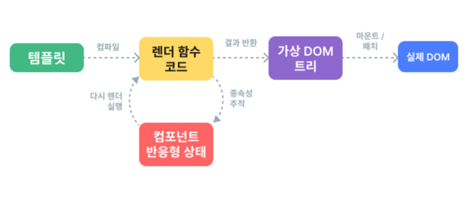

### Virtual DOM 패턴의 장점
- 효율성
    - 실제 DOM 동작을 최소화하고, 변경된 부분만 업데이트하여 성능 향상

- 반응성
    - 데이터의 변경을 감지하고, Vitual DOM을 효율적으로 갱신하여 UI를 자동으로 업데이트

- 추상화
    - 개발자는 실제 DOM 조작을 Vue에게 맡기고 컴포넌트와 템플릿을 활용하는 추상화된 프로그래밍 방식으로 원하는 UI 구조를 구성하고 관리할 수 있음

### Virtual DOM 주의사항
- 실제 DOM에 직접 접근하지 말 것
    - JS에서 사용하는 DOM 접근 관련 메서드 사용 금지
    -querySelector, createElement, addEventListener 등

- Vue의 ref와 Lifecycle Hooks 함수를 사용해 간접적으로 접근하여 조작할 것

### 직접 DOM 엘리먼트에 접근해야 하는 경우
- ref 속성을 사용하여 특정 DOM 엘리먼트에 직접적인 참조를 얻을 수 있음
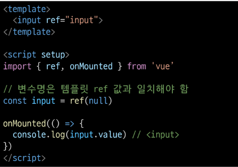

### **Composition API & Option API**
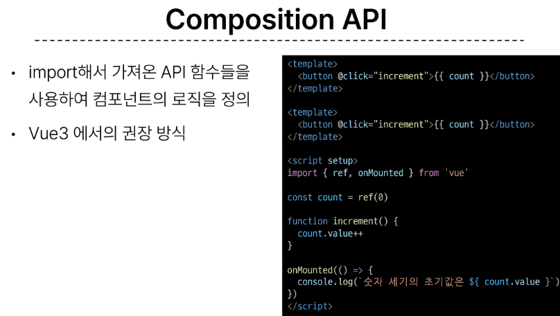
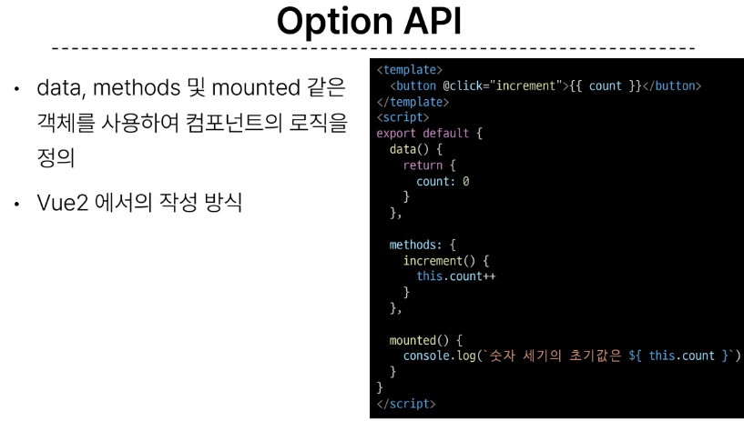
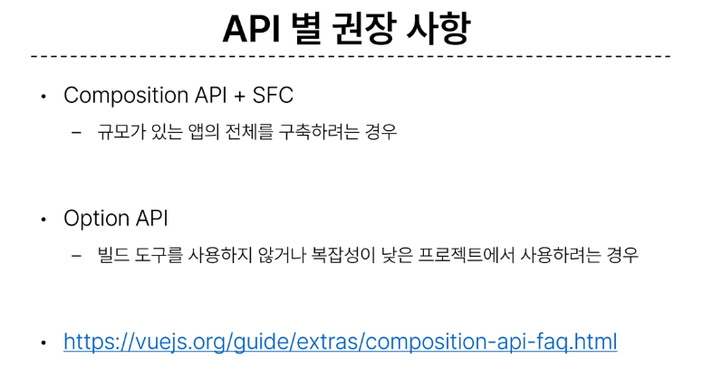

## 참고
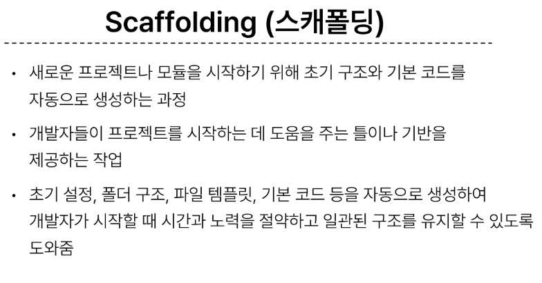
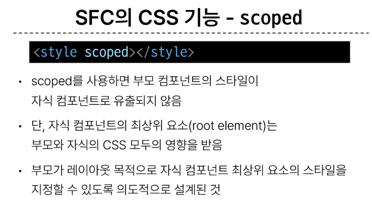
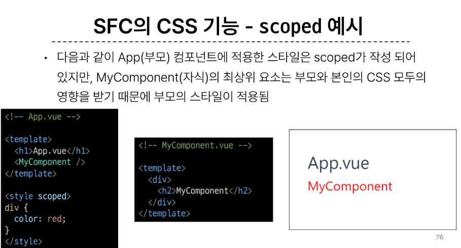
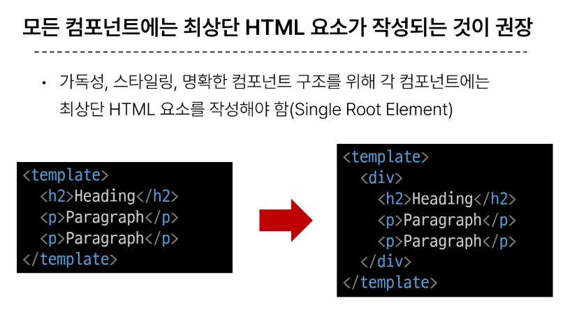
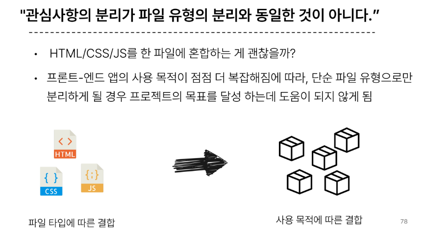