# Component state Flow

## 1. Passing Props

### **개요**
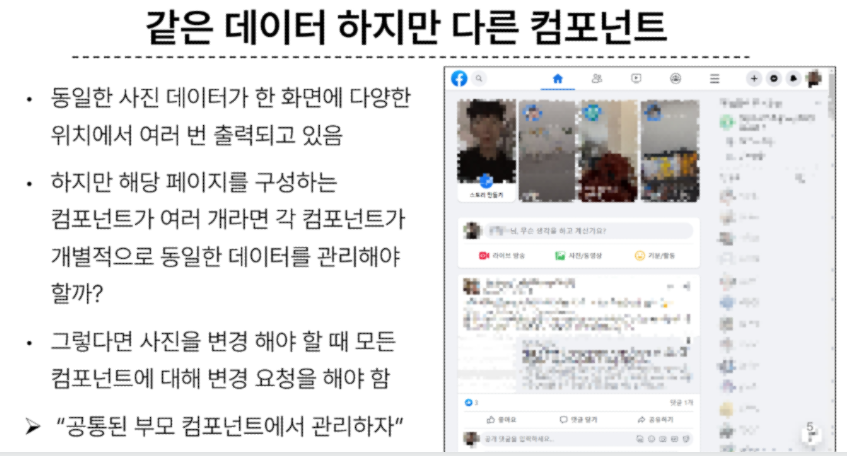  
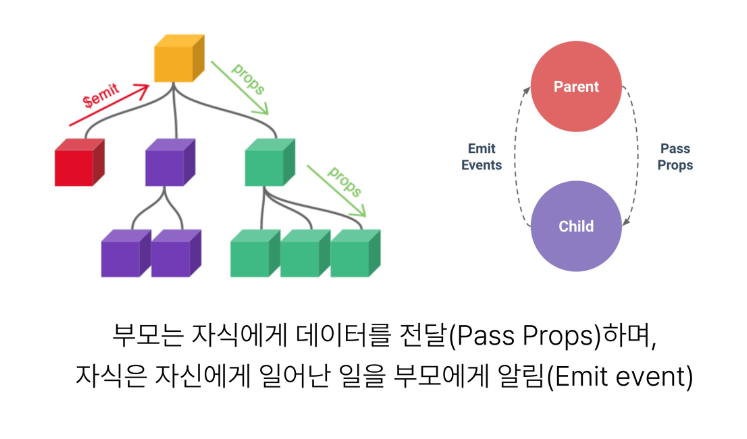

### Props
- 부모 컴포넌트로부터 자식 컴포넌트로 데이터를 전달하는데 사용되는 속성

### One-Way Data Flow
- 모든 props는 자식 속성과 부모 속성 사이에 **하향식 단방향 바인딩**을 형성 (one-way-down binding)

### Props 특징
- 부모 속성이 업데이트되면 자식으로 흐르지만 그 반대는 안됨
- 즉, 자식 컴포넌트 내부에서 props를 변경하려고 시도해서는 안되며 불가능
- 또한 부모 컴포넌트가 업데이트될 때마다 자식 컴포넌트의 모든 props가 최신 값으로 업데이트 됨
- 부모 컴포넌트에서만 변경하고 이를 내려 받는 자식 컴포넌트는 자연스럽게 갱신되는것이다.

### 단방향인 이유
- 하위 컴포넌트가 실수로 상위 컴포넌트의 상태를 변경하여 앱에서의 데이터 흐름을 이해하기 어렵게 만드는 것을 방지하기 위함

### Props 예시 실습 사전준비
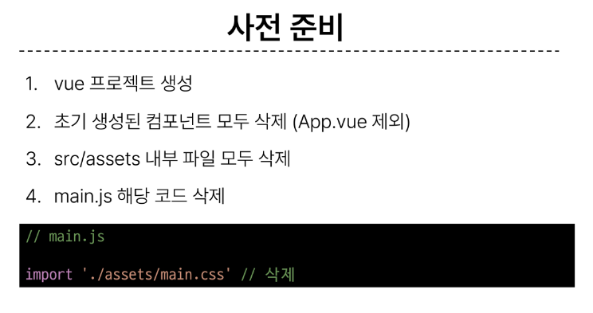
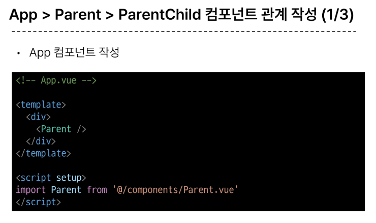
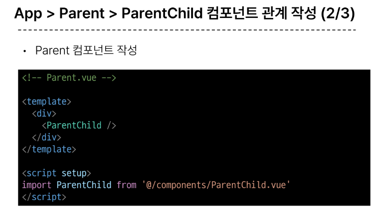
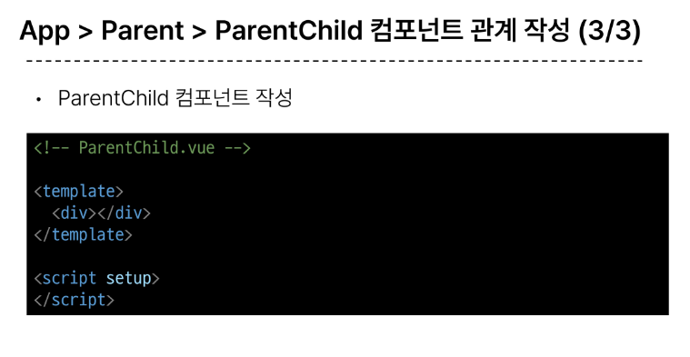

### **Props 선언**

### Props 선언
- 부모 컴포넌트에서 보낸 props를 사용하기 위해서는 자식 컴포넌트에서 명시적인 props 선언이 필요

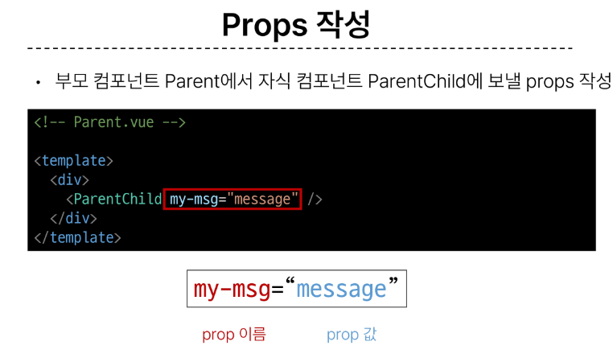

### **Props 선언 2가지 방식**
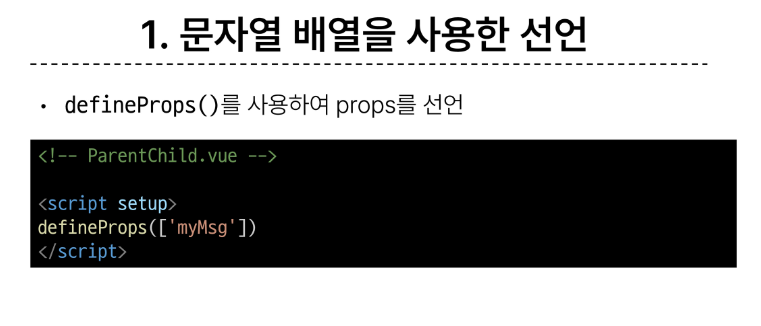
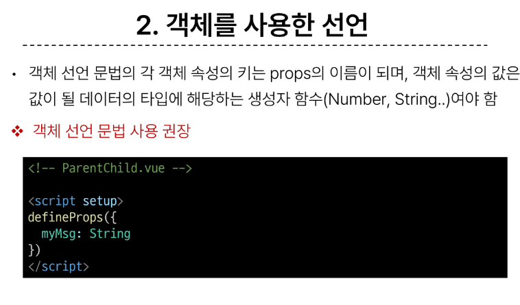

### **prop 데이터 사용**
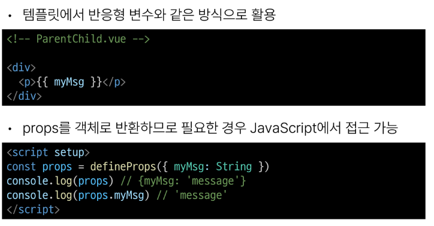
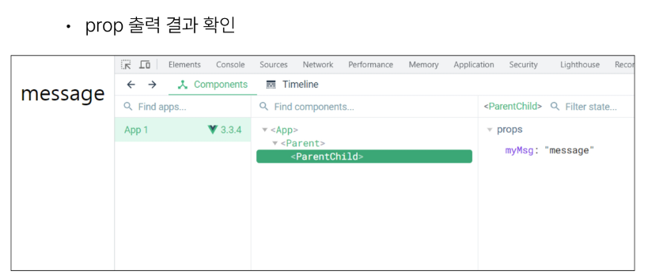

## 2. Component Events