# Router

## 1. Routing

### **개요**

#### Routing

- 네트워크에서 경로를 선택하는 프로세스

- 웹 애플리케이션에서 다른 페이지 간의 전환과 경로를 관리하는 기술

#### SSR에서의 Routing
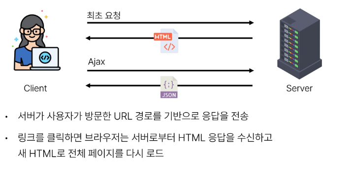  
  

#### CSR/SPA 에서의 Routing
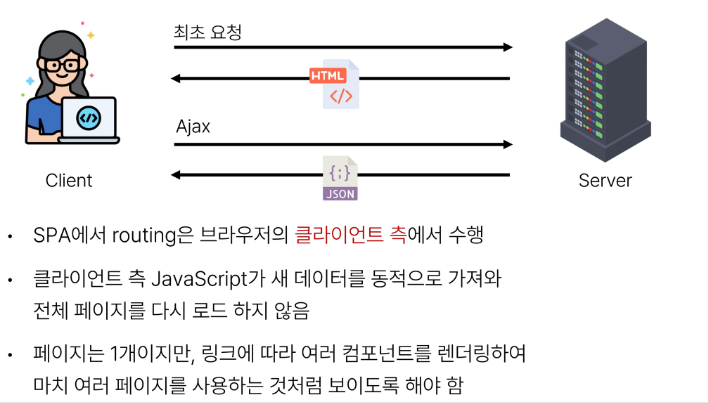  

#### 만약 routing이 없다면?
- 유저가 URL을 통한 페이지의 변화를 감지할 수 없음
- 페이지가 무엇을 렌더링 중인지에 대한 상태를 알 수 없음
    - URL이 1개이기 때문에 새로 고침 시 처음 페이지로 되돌아감
    - 링크를 공유할 시 첫 페이지만 공유 가능
- 브라우저의 뒤로 가기 기능을 사용할 수 없음

## 2. Vue Router

### **개요**

#### Vue Router
- Vue 공식 라우터

#### Vue Router 추가
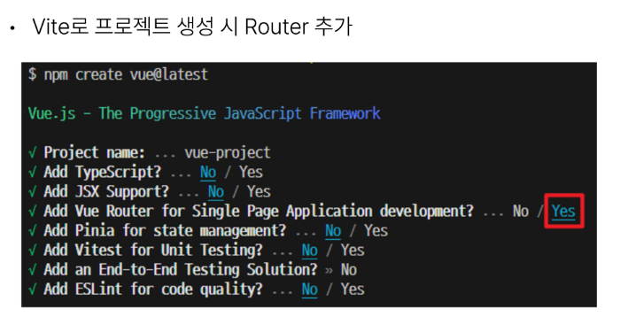
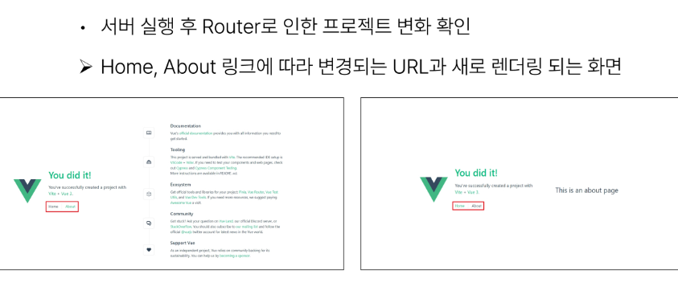

#### Vue 프로젝트 구조 변화
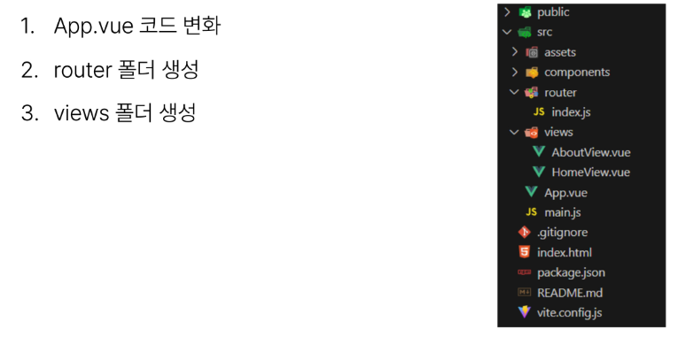

#### RouterLink
- 페이지를 다시 로드하지 않고 URL을 변경하고 URL 생성 및 관련 로직을 처리
- HTML의 a 태그를 렌더링
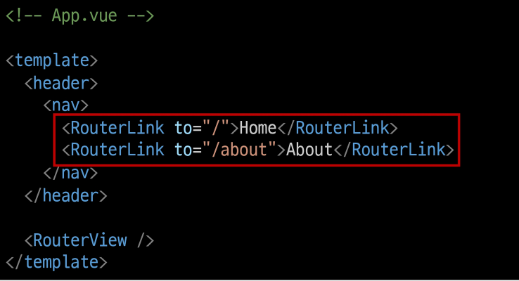

#### RouterView
- URL에 해당하는 컴포넌트를 표시
- 어디에나 배치하여 레이아웃에 맞출 수 있음
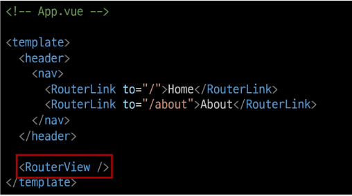

#### router/index.js
- 라우팅에 관련된 정보 및 설정이 작성 되는 곳
- router에 URL과 컴포넌트를 매핑

#### views
- RouterView 위치에 렌더링 할 컴포넌트를 배치
- 기존 components 폴더와 기능적으로 다른 것은 없으며 단순 분류의 의미로 구성됨
- 일반 컴포넌트와 구분하기 위해 컴포넌트 이름을 View로 끝나도록 작성하는 것을 권장

### Basic Routing

#### 라우팅 기본
1. index.js에 라우터 관련 설정 작성(주소, 이름, 컴포넌트)
2. RouterLink의 'to' 속성으로 index.js 에서 정의한 주소 속성 값(path)을 사용
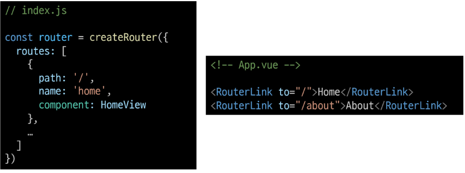

### Named Routes

#### Named Routes
- 경로에 이름을 지정하는 라우팅

#### Named Routes 예시
- name 속성 값에 경로에 대한 이름을 지정
- 경로에 연결하려면 RouterLink에 v-bind를 사용해 'to' prop 객체로 전달
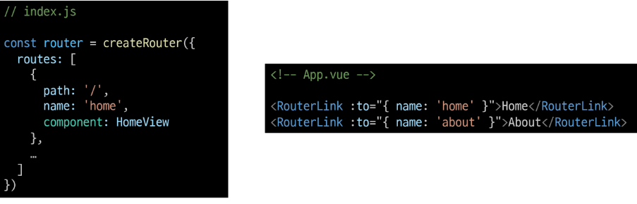

#### Named Routes 장점
- 하드 코딩 된 URL을 사용하지 않아도 됨
- URL 입력 시 오타 방지

### Dynamic Route Matchin With Params

#### 매개 변수를 사용한 동적 경로 매칭
- 주어진 패턴 경로를 동일한 컴포넌트에 매핑 해야 하는 경우 활용
- 예를 들어 모든 사용자의 ID를 활용하여 프로필 페이지 url을 설계 한다면?
    - user/1
    - user/2
    - user/3
    - 일정한 패턴의 URL 작성을 반복해야함

#### 매개 변수를 사용한 동적 경로 매칭 활용
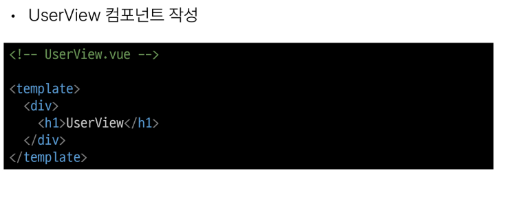
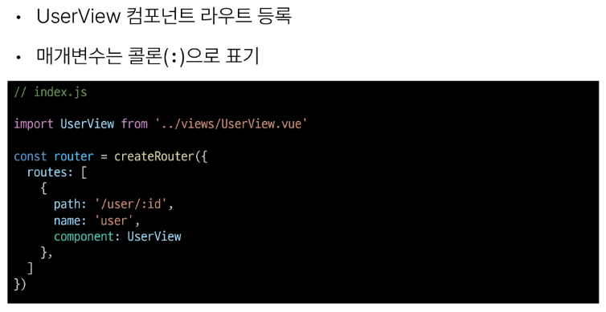
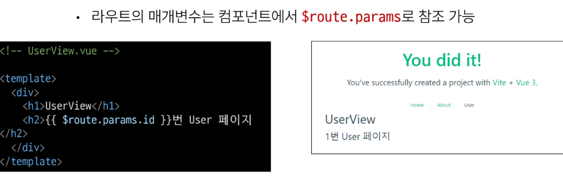
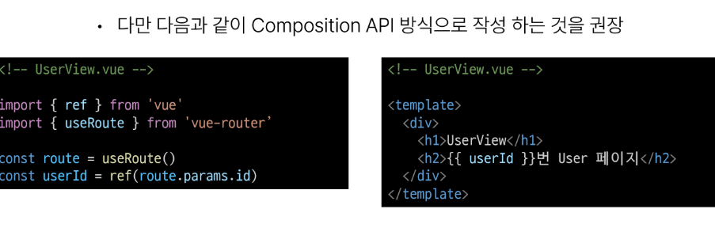

### Programmatic Navigation

#### 프로그래밍 방식 네비게이션
- router의 인스턴스 메서드를 사용해 RouterLink로 a 태그를 만드는 것 처럼 프로그래밍으로 네비게이션 관련 작업을 수행할 수 있음
1. 다른 위치로 이동하기
    - router.push()
2. 현재 위치 바꾸기
    - router.replace()

#### router.push()
- 다른 URL로 이동하는 메서드
- 새 항목을 history stack에 push하므로 사용자가 브라우저 뒤로 가기 버튼을 클릭하면 이전 URL로 이동할 수 있음
- RouterLink를 클릭했을 때 내부적으로 호출되는 메서드 이므로 RouterLink를 클릭하느 것은 router.push()를 호출하는 것과 같음
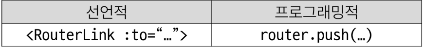

#### router.push 활용
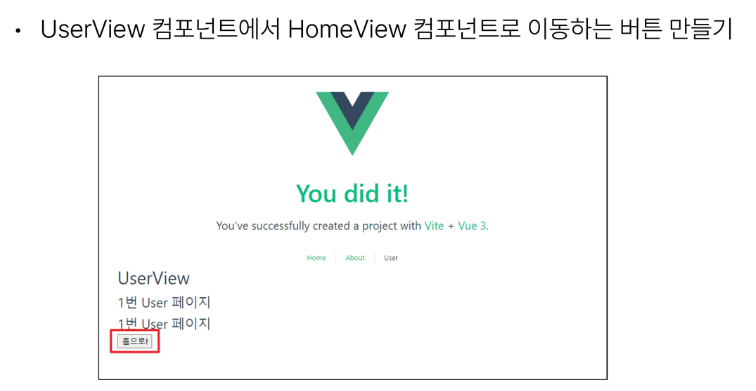
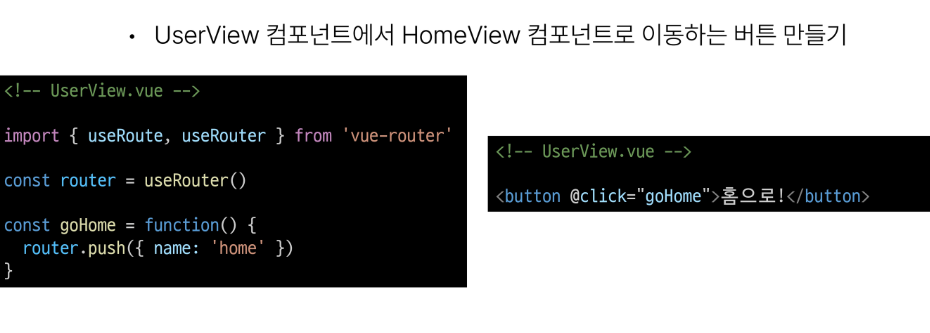

#### router.push 인자 활용 참고
- https://router.vuejs.org/guide/essentials/navigation.html/

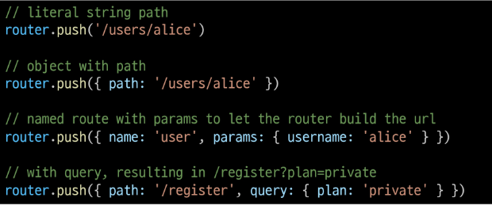

#### router.replace()
- push 메서드와 달리 history stack에 새로운 항목을 push 하지 않고 다른 URL로 이동 (=== 이동 전 URL로 뒤로 가기 불가)

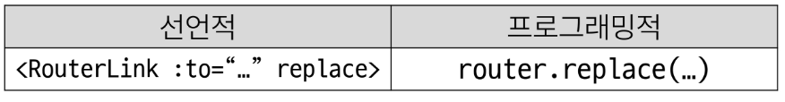

## 3. Navigation Guard

### 개요

#### Navigation Guard
- Vue router를 통해 특정 URL에 접근할 때 다른 URL로 redirect를 하거나 취소하여 네비게이션을 보호
- ex) 인증 정보가 없으면 특정 페이지에 접근하지 못하게 함

#### Navigation Guard 종류
1. Globally (전역 가드)
- 애플리케이션 전역에서 동작
- index.js에서 정의
2. Per-route (라우터 가드)
- 특정 route에서만 동작
- index.js의 각 routes에 정의
3. In-component (컴포턴트 가드)
- 특정 컴포넌트 내에서만 동작
- 컴포넌트 Script에 정의

### Globally Guard

#### router.beforeEach()
- 다른 URL로 이동하기 직전에 실행되는 함수 (Global Before Guards)

#### router.beforeEach 구조

- to   : 이동 할 URL 정보가 담긴 Route 객체
- from : 현재 URL 정보가 담긴 Route 객체
- 선택적 반환(return) 값
1. false
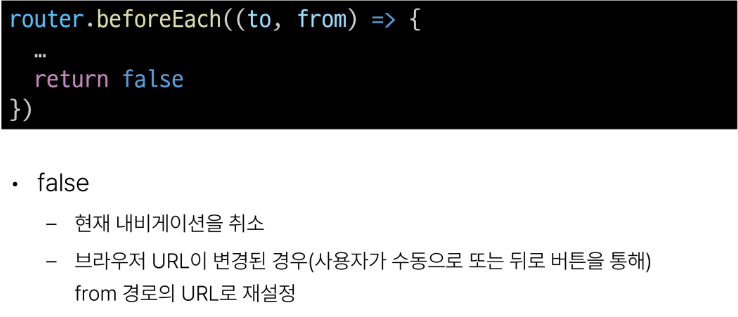
2. Route Location
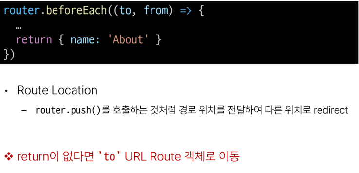

### Per-route Guard

#### router.beforeEnter()
- route에 진입했을때만 실행되는 함수
- 매개변수, 쿼리 값이 변경될 때는 실행되지 않고 다른 경로에서 탐색할 때만 실행됨

