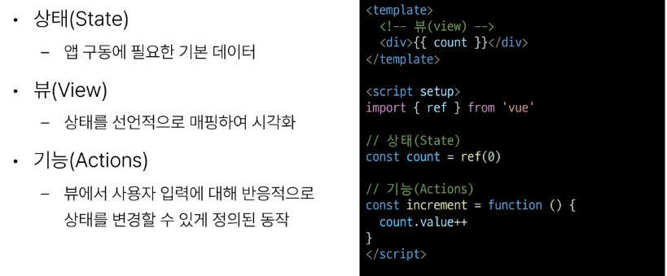
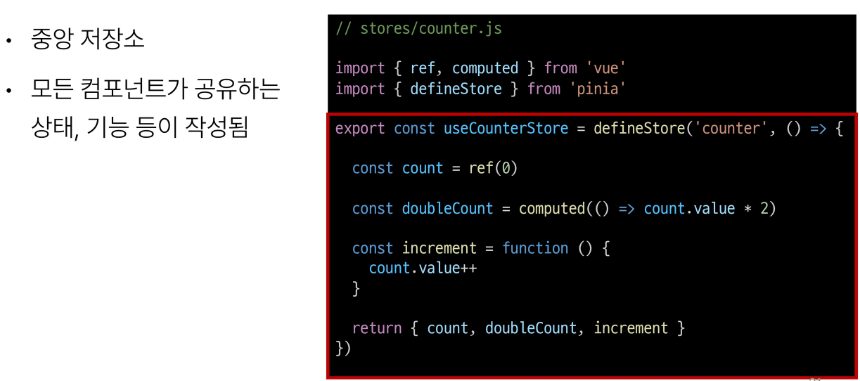

# State Management

## 1. State Management

### 개요

#### State Management(상태 관리)
- Vue 컴포넌트는 이미 반응형 상태를 관리하고 있음
- 상태 === 데이터

#### 컴포넌트 구조의 단순화

#### 상태 관리의 단순성이 무너지는 시점
- 여러 컴포넌트가 상태를 공유할 때
  1. 여러 뷰가 동일한 상태에 종속되는 경우
  2. 서로 다른 뷰의 기능이 동일한 상태를 변경시켜야 하는 경우

1. 여러 뷰가 동일한 상테에 종속되는 경우
- 공유 상태를 공통 조상 컴포넌트로 "끌어올린" 다음 props로 전달하는 것
- 하지만 계층 구조가 깊어질 경우 비효율적, 관리가 어려워짐

2. 서로 다른 뷰의 기능이 동일한 상태를 변경시켜야 하는 경우
- 발신(emit)된 이벤트를 통해 상태의 여러 복사본을 변경 및 동기화 하는 것
- 마찬가지로 관리의 패턴이 깨지기 쉽고 유지 관리할 수 없는 코드가 됨

#### 해결책
- 각 컴포넌트의 공유 상태를 추출하여, 전역에서 참조할 수 있는 저장소에서 관리

- 컴포넌트 트리는 하나의 큰 "뷰"가 되고 모든 컴포넌트는 트리 계층 구조에 관계 없이 상태에 접근하거나 기능을 사용할 수 있음
- Vue의 공식 상태 관리 라이브러리 === "Pinia"

## 2. State management library (Pinia)

### Pinia

#### Pinia
- Vue의 공식 상태 관리 라이브러리

### Pinia 구조

#### Pinia 구성 요소
1. store

2. state

3. getters

4. actions

5. plugin
- 애플리케이션의 상태 관리에 필요한 추가 기능을 제공하거나 확장하는 도구나 모듈
- 애플리케이션의 상태 관리를 더욱 간편하고 유연하게 만들어주며 패키지 매니저로 설치 이후 별도 설정을 통해 추가 됨

#### Pinia 구성 요소 종합
- Pinia는 store라는 저장소를 가짐
- store는 state, getters, actions으로 이루어지며 각각 ref(), computed(), function()과 동일함

## 3. Pinia 실습

### 07-state-manage 폴더 vue-project 참조