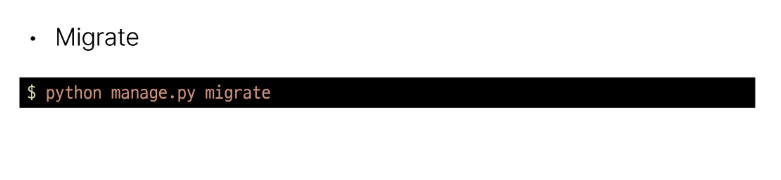
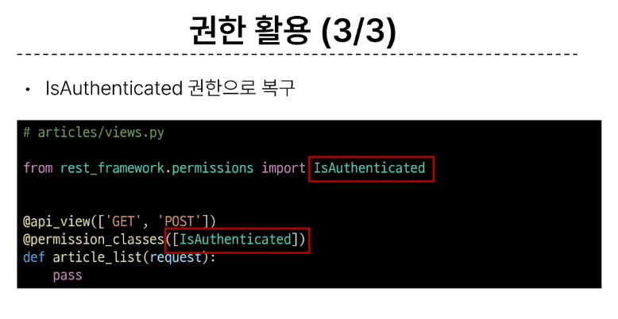
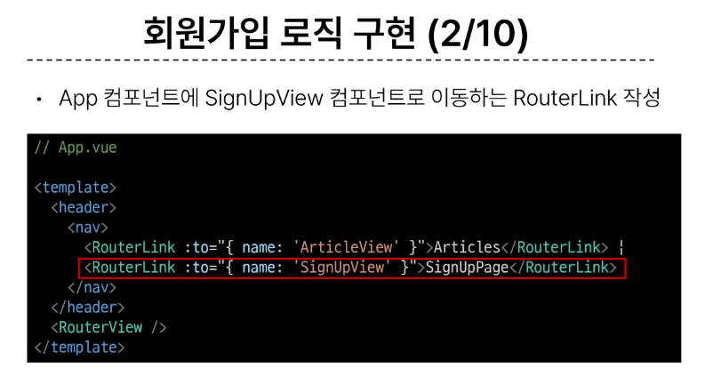
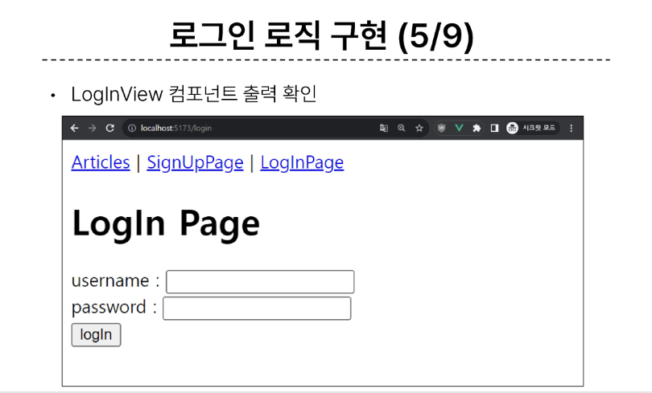
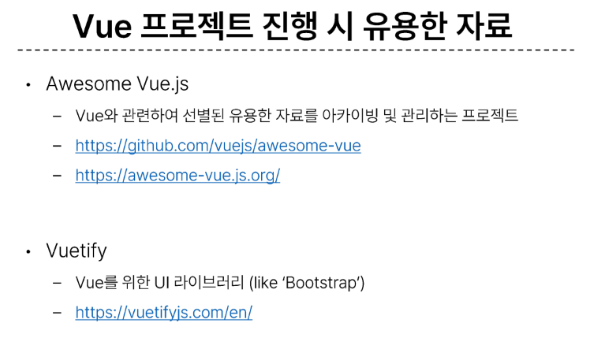

# Vue with DRF 2

## 1. DRF Authentication

### 개요

### Authetication

#### Authentication(인증)
- 수신된 요청을 해당 요청의 사용자 또는 자격 증명과 연결하는 매커니즘
- 누구인지를 확인하는 과정

#### Permissions (권한)
- 요청에 대한 접근 허용 또는 거부 여부를 결정

#### 인증과 권한
- 인증이 먼저 진행되며 수신 요청을 해당 요청의 사용자 또는 해당 요청이 서명된 토큰(token)과 같은 일련의 자격 증명과 연결
- 그런 다음 권한 및 제한 정책(throttling policies)은 인증이 완료된 해당 자격 증명을 사용하여 요청을 허용해야 하는 지를 결정

#### DRF 에서의 인증
- 인증은 항상 view 함수 시작 시, 권한 및 제한 확인이 발생하기 전, 다른 코드의 진행이 허용되기 전에 실행됨
- https://www.django-rest-framework.org/api-guide/authentication/
- 인증 자체로는 들어오는 요청을 허용하거나 거부할 수 없으며, 단순히 요청에 사용된 자격 증명만 식별한다는 점에 유의

#### 승인되지 않은 응답 및 금지된 응답
- 인증되지 않은 요청이 권한을 거부하는 경우 해당되는 두 가지 오류 코드가 응답
1. HTTP 401 Unauthorized
- 요청된 리소스에 대한 유효한 인증 자격 증명이 없기 때문에 클라이언트 요청이 완료되지 않았음을 나타냄
2. HTTP 403 Forbidden (Permisson Denied)
- 서버에 요청이 전달되었지만, 권한 때문에 거절되었다는 것을 의미
- 401과 다른 점은 서버는 클라이언트가 누구인지 알고 있음

### 인증 체계 설정

#### 인증 체계 설정 방법
1. 전역 설정
- DEFAULT_AUTHENTICATION_CLASSES를 사용

2. View 함수 별 설정
- authentication_classes 데코레이터를 사용

#### DRF가 제공하는 인증 체계
1. BasicAuthentication
2. **TokenAuthentication**
3. SessionAuthentication
4. RemoteUserAuthentication

#### TokenAuthentication
- 간단한 token 기반 HTTP 인증 체계
- 기본 데스크톱 및 모바일 클라이언트와 같은 클라이언트-서버 설정에 적합
- https://www.django-rest-framework.org/api-guide/authentication/#tokenauthentication
- 서버가 사용자에게 토큰을 발급하여 사용자는 매 요청마다 발급받은 토큰을 요청과 함께 보내 인증 과정을 거침

### TokenAuthentication 설정

#### TokenAuthentication 적용 과정
1. 인증 클래스 설정

2. INSTALLED_APPS 추가

3. Migrate 진행

4. 토큰 생성 코드 작성

### Dj-Rest Auth 라이브러리

#### Dj-Rest-Auth
- 회원가입, 인증(소셜미디어 인증 포함), 비밀번호 재설정, 사용자 세부 정보 검색, 회원 정보 수정 등 다양한 인증 관련 기능을 제공하는 라이브러리
- https://github.com/iMerica/dj-rest-auth/

#### Dj-Rest-Auth 설치 및 적용

#### Dj-Rest-Auth의 Registration(등록) 기능 추가 설정
1. 패키지 추가 설치
2. 추가 App 등록
3. 추가 URL 등록
4. Migrate
- https://dj-rest-auth.readthedocs.io/en/latest/installation.html#registration-optional/

#### Registration 기능 추가

### Token 발급 및 활용

### 권한 정책 설정

#### 권한 설정 방법
1. 전역 설정

2. View 함수 별 설정

#### DRF가 제공하는 권한 정책
1. **IsAuthenticated**
2. IsAdminUser
3. IsAuthenticated0rReadOnly
4. ....
- https://www.django-rest-framework.org/api-guide/permissions/#api-reference/

#### IsAuthenticated 권한
- 인증되지 않은 사용자에 대한 권한을 거부하고 그렇지 않은 경우 권한을 허용
- 등록된 사용자만 API에 엑세스할 수 있도록 하려는 경우에 적합

### IsAuthenticated 권한 설정

## 2. Authentication with Vue

### 회원가입

### 로그인

### 요청과 토큰

#### Token을 store에 저장하여 인증이 필요한 요청마다 함께 보낸다.

  

### 인증 여부 확인

### 기타 기능 구현

### 참고

