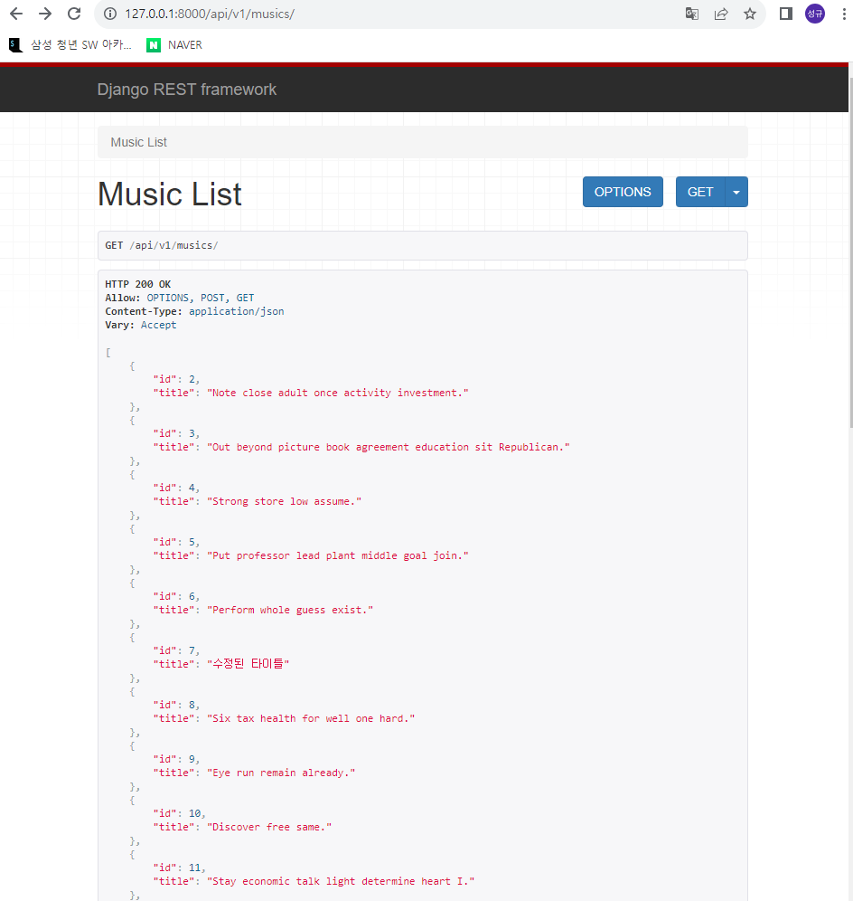
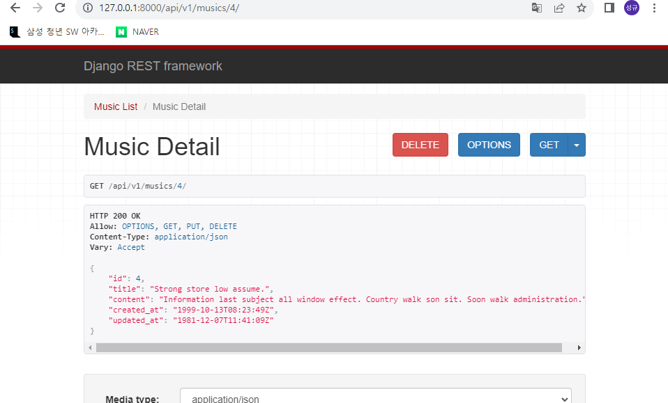
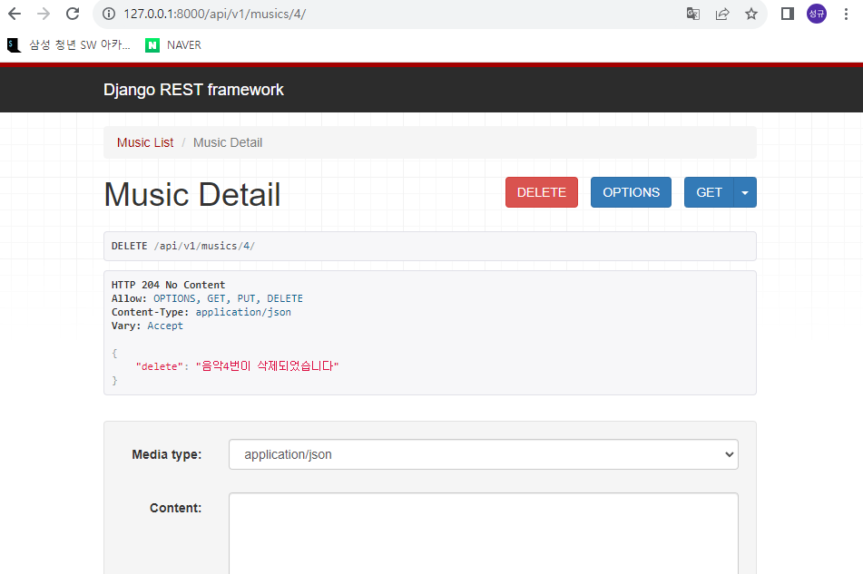
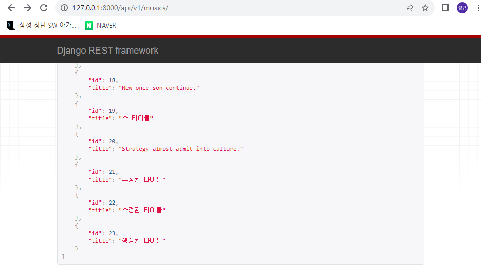

1. Serializer 정의
   
   ```python
   from .models import Music
   from rest_framework import serializers
   
   class MusicListSerializer(serializers.ModelSerializer):
       class Meta:
           model = Music
           fields = ('id','title')
   
   class MusicSerializer(serializers.ModelSerializer):
       class Meta:
           model = Music
           fields = '__all__'
   ```

2. urls.py 구성
   
   ```python
   #project/urls.py
   from django.contrib import admin
   from django.urls import path, include
   
   urlpatterns = [
       path("admin/", admin.site.urls),
       path("api/v1/", include("music.urls")),
   ]
   
   
   
   #musics/urls.py
   from django.urls import path
   from . import views
   
   
   urlpatterns = [
       path('musics/',views.music_list),
       path('musics/<int:music_pk>/',views.music_detail),
   ]
   
   
   ```

3. music_list, music_detail 함수 정의
   
   ```python
   from rest_framework.decorators import api_view
   from rest_framework.response import Response
   from rest_framework import status
   from .models import Music
   from .serializers import MusicListSerializer, MusicSerializer
   
   
   
   @api_view(['GET','POST'])
   def music_list(request):
       # 전체 음악 조회
       if request.method == 'GET':
           musics = Music.objects.all()
           serializer = MusicListSerializer(instance = musics, many = True)
           return Response(data = serializer.data)
       # 음악 생성
       elif request.method =='POST':
           serializer = MusicSerializer(data = request.data)
           if serializer.is_valid():
               serializer.save()
               return Response(status=status.HTTP_201_CREATED)
           return Response(serializer.errors, status=status.HTTP_400_BAD_REQUEST)
   
   @api_view(['GET', 'PUT', 'DELETE'])
   def music_detail(request, music_pk):
       music = Music.objects.get(pk=music_pk)
       
       # 상세 음악 조회
       if request.method == 'GET':
           serializer = MusicSerializer(music)
           return Response(data=serializer.data, status=status.HTTP_200_OK)
       
       # 상세 음악 수정
       elif request.method == 'PUT':
           serializer = MusicSerializer(instance=music, data = request.data)
           if serializer.is_valid():
               serializer.save()
               return Response(status=status.HTTP_201_CREATED)
           return Response(status=status.HTTP_400_BAD_REQUEST)
       
       # 상세 음악 삭제
       elif request.method == 'DELETE':
           pk = music_pk
           music.delete()
           return Response({'delete' : f'음악{pk}번이 삭제되었습니다'}, status=status.HTTP_204_NO_CONTENT)
   
   
       
   ```

- 전체 음악 조회


- 상세 음악 조회


- 상세 음악 삭제


- 상세 음악 수정, 삭제
