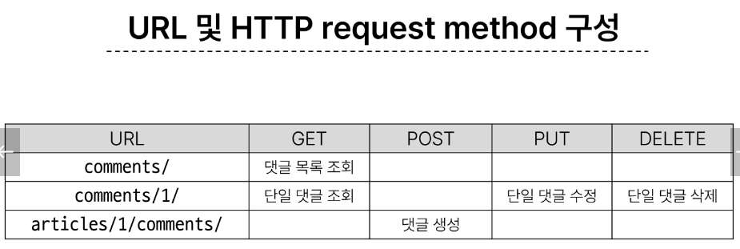
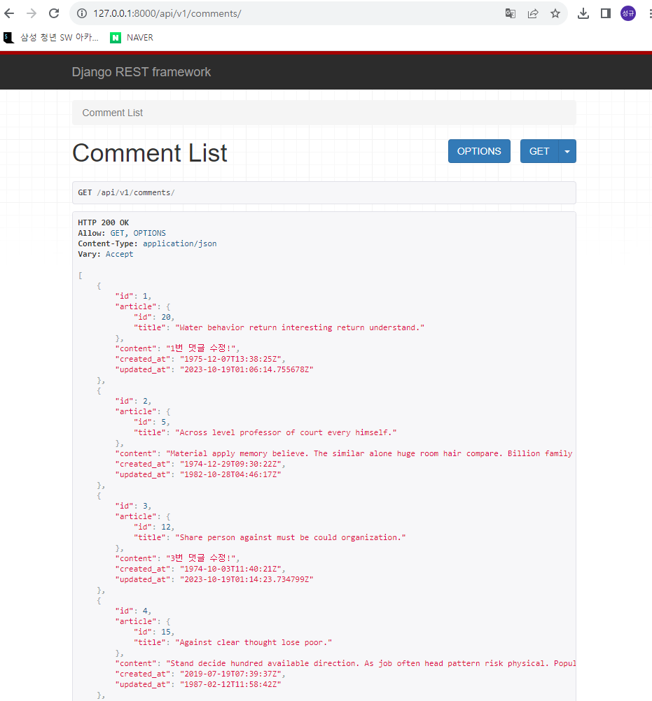
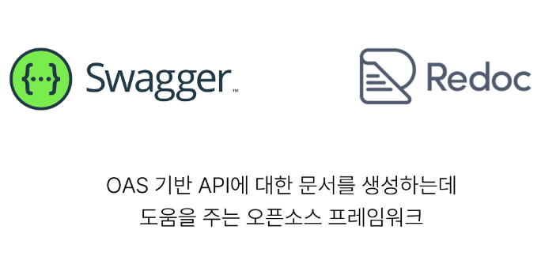

# Django REST framework2

## 1. DRF with N:1 Relation




### GET
#### GET : LIST
- 댓글 목록 조회를 위한 CommentSerializer정의
  
  ```python
  # articles/serializers.py
  from rest_framework import serializers
  from .models import Article, Comment
  class CommentSerializer(serializers.ModelSerializer):

      class ArticleTitleSerializer(serializers.ModelSerializer):
          class Meta:
              model = Article
              fields = ('id','title',)

      # override (댓글 조회 시 게시글 번호만 제공해주는 것이 아닌 게시글 제목까지 제공해보자)

      article = ArticleTitleSerializer(read_only=True)

      class Meta:
          model = Comment
          fields = '__all__'
          # read_only_fields = ('article',)
  ```
- url 작성
  
  ```python
  url_patterns = [
    path('comments/', views.comment_list),
  ]
  ```

- view 함수 작성
  
  ```python
  # articles/views.py
  from .models import Article, Comment
  from .serializers import ArticleListSerializer,ArticleSerializer,
  CommentSerialzier

  @api_view(['GET'])
  def comment_list(request):
      comments = get_list_or_404(Comment)
      #comments = Comment.objects.all()
      serializer = CommentSerializer(instance = comments, many=True)

      return Response(data = serializer.data)
  
  ```
  ####  결과확인

  

---

#### GET : Detail
- 단일 댓글 조회를 위한 url 및 view 함수 작성
  ```python
    #articles/urls.py
    from django.urls import path
    from articles import views


    urlpatterns = [
        path('comments/<int:comment_pk>/', views.comment_detail),
    ]
    
    #articles/views.py
    @api_view(['GET', 'DELETE','PUT'])
    def comment_detail(request, comment_pk):
      
        #comment = Comment.objects.get(pk = comment_pk)
        comment = get_object_or_404(Comment, pk = comment_pk)

        if request.method == 'GET':
            serializer = CommentSerializer(instance=comment)
            return Response(data = serializer.data)
  ```

---

### POST

- POST
  - 단일 댓글 생성을 위한 url 및 view 함수 작성
  ```python
    #articles/urls.py
    from django.urls import path
    from articles import views


    urlpatterns = [
        path('articles/<int:article_pk>/comments/', views.comment_create),
    ]
    
    #articles/views.py
    from rest_framework.response import Response
    from rest_framework.decorators import api_view
    from rest_framework import status
    from .models import Article, Comment
    from .serializers import ArticleListSerializer, ArticleSerializer, CommentSerializer

    from django.shortcuts import get_list_or_404, get_object_or_404


    @api_view(['POST'])
    def comment_create(request, article_pk):
        article = get_object_or_404(Article, pk = article_pk)
        # 데이터를 전송하는 시점에 article field 또한 사용자로부터 입력 받도록 설정되어 있기 때문에 400 응답코드가 날아옴
        #따라서 데이터를 전송하는 시점에 "유효성 검사에서 제외시키고, 데이터 조회시에는 출력" 하는 일기 전용 필드를 serializer에 선언해줘야함
        serializer = CommentSerializer(data = request.data)
        if serialzier.is_valid(raise_exception=True):
          # serializer 인스턴스의 save()메서드는
          # 특정 Serializer 인스턴스를 저장하는 과정에서 추가 데이터 받기 가능
          serializer.save(article=article)
          return Response(data = serializer.data, status=status.HTTP_201_CREATED)

    #articles/serialziers.py
    class CommentSerializer(serializers.ModelSerializer):
      class Meta:
          model = Comment
          fields = '__all__'
          read_only_fields = ('article',)
  ```

### DELETE & PUT

- 단일 댓글 삭제 및 수정을 위한 view 함수 작성
  ```python
    @api_view(['GET', 'DELETE','PUT'])
    def comment_detail(request, comment_pk):
      #comment = Comment.objects.get(pk = comment_pk)
      comment = get_object_or_404(Comment, pk = comment_pk)

      if request.method == 'GET':
          serializer = CommentSerializer(instance=comment)
          return Response(data = serializer.data)
      
      elif request.method =='DELETE':
          comment.delete()
          return Response(status=status.HTTP_204_NO_CONTENT)
      
      elif request.method == 'PUT':
          serializer = CommentSerializer(comment, data=request.data)
          if serializer.is_valid(raise_exception=True):
              serializer.save()
              return Response(serializer.data)
  ```
### 응답 데이터 재구성
- 댓글 조회 시 게시글 출력 내역 변경
  - 게시글 번호만 제공해주는 것이 아닌 게시글의 제목까지 제공하기
    ```python
      class CommentSerializer(serializers.ModelSerializer):

        # 필요한 데이터를 만들기 위한 Serialzier는 내부에서 추가 선언 가능
        class ArticleTitleSerializer(serializers.ModelSerializer):
            class Meta:
                model = Article
                fields = ('title',)
        # override 하면 read_only_fields 사용 불가함
        article = ArticleTitleSerializer(read_only=True)

        class Meta:
            model = Comment
            fields = '__all__'
            # read_only_fields = ('article',)
    ```
---
---
---
## 2. 역참조 데이터 구성

### Article -> Comment 간 역참조 관계를 활용한 JSON 데이터 재구성
1. 단일 게시글 조회 시 **해당 게시글에 작성된 댓글 목록 데이터**도 함께 붙여서 응답
2. 단일 게시글 조회 시 **해당 게시글에 작성된 댓글 개수 데이터**도 함께 붙여서 응답

### 단일 게시글 + 댓글 목록 + 댓글 개수 데이터
- Nested relationships
  - 모델 관계 상으로 참조하는 대상은 참조되는 대상의 표현에 포함되거나 중첩가능
  - 이러한 중첩된 관계는 serializers 필드로 사용하여 표현 가능
  ```python
    class ArticleSerializer(serializers.ModelSerializer):
    
      # class CommentSerializer(serializers.ModelSerializer):
      #     class Meta:
      #         model = Comment
      #         fields = ('id','content')

      # 역참조 데이터 구성
      # 단일 게시글 조회시 해당 게시글에 작성된 댓글 목록 데이터, 댓글 개수 데이터도 함께 붙여서 응답
      # 댓글 목록
      comment_set = CommentSerializer(many=True, read_only=True)
      # 댓글 개수
      comment_count = serializers.IntegerField(source='comment_set.count', read_only=True)
      class Meta:
          model = Article
          fields = '__all__'
  ```

### 주의 : 읽기 전용 필드 지정 이슈
- 특정 필드를 override 혹은 추가한 경우 read_only_fields는 동작하지 않음
- 해당 필드의 read_only 키워드 인자로 작성해야 함


## 3. API 문서화

### OpenAPI Specification (OAS)
- RESTful API를 설명하고 시각화하는 표준화된 방법
- API에 대한 세부사항을 기술할 수 있는 공식 표준
- 
- 참조
  - https://drf-spectacular.readthedocs.io/en/latest/


### OAS의 핵심 이점 - "설계 우선" 접근법
- API를 먼저 설계하고 명세를 작성한 후, 이를 기반으로 코드를 구현하는 방식
- API의 일관성을 유지하고, API 사용자는 더 쉽게 API를 이해하고 사용할 수 있음
- 또한, OAS를 사용하면 API가 어떻게 작동하는지를 시각적으로 보여주는 문서를 생성할 수 있으며, 이는 API를 이해하고 테스트하는데 매우 유용
- 이런 목적으로 사용되는 도구가 Swagger-UI 또는 ReDoc


## 참고

### Django shortcuts functions
- get_object_or_404()
  - 모델 manager objects에서 get()을 호출하지만, 해당 객체가 없을 땐 기존 DoesNotExist 예외 대신 HTTP404를 return

- get_list_or_404()
  - 모델 manager objects에서 filter()의 결과를 반환하고, 해당 객체목록이 없을 땐 HTTP404를 return
  
- 왜 사용해야 할까?
  - 클라이언트에게 "서버가 오류가 발생하여 요청을 수행할 수 없다.(HTTP500)"라는 원인이 정확하지 않은 에러를 제공하기 보다는, 적절한 예외처리를 통해 클라이언트에게 보다 정확한 에러 현황을 전달하는 것도 매우 중요한 개발 요소 중 하나이기 때문