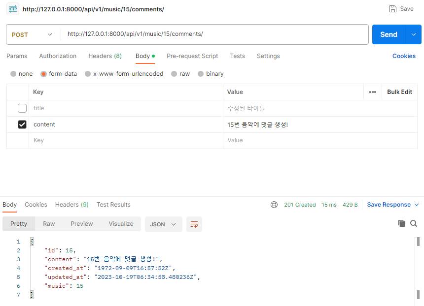

1. 전체 댓글 조회
   
  
2. 상세 댓글 조회
  
  

3. 댓글 생성
   
  


**전체 댓글 조회시 주의점**
  ```python
  @api_view(['GET'])
  def comment_list(request):
    comments = get_list_or_404(Comment)
    # many = True를 해주어야 함 !
    serialzier = CommentSerializer(instance = comments, many = True)
    return Response(data = serialzier.data, status=status.HTTP_200_OK)
  ```

**댓글 생성과정에서 생기는 에러**
```python
class CommentSerializer(serializers.ModelSerializer):
    class Meta:
        model = Comment
        fields ='__all__'
        # 외래키 사용시 외래키의 필수입력 필드를 수정하지 않아도
        # 필수 입력 받도록 설정되어 있기에
        # read_only_fields 로 설정하여 에러 해결
        read_only_fields = ('music',)


```
