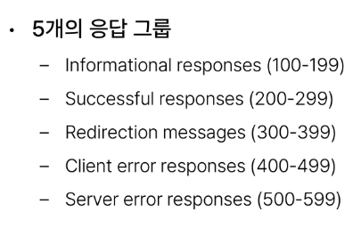
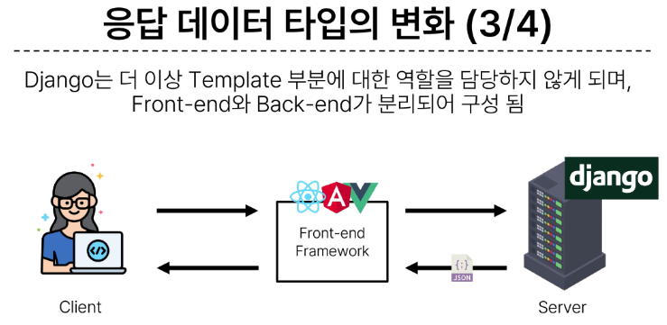

# Django REST Framework1

### 1. REST API
- API(Application Programming Interface)
  - 애플리케이션과 프로그래밍으로 소통하는 방법
  - 클라이언트-서버 관계처럼 서로 다른 프로그램에서 요청과 응답을 받을 수 있도록 만든 체계

-  REST(Representational State Transfer)
   -  API Server를 개발하기 위한 일종의 소프트웨어 설계 방법론(약속(규칙X))
   -  REST 원리를 따르는 시스템을 RESTful하다고 부름
   -  "자원을 정의" 하고 "자원에 대한 주소를 지정" 하는 전반적인 방법을 서술

- REST API
  - REST라는 설계 디자인 약속을 지켜 구현한 API

- REST에서 자원을 정의하고 주소를 지정하는 방법
1. 자원의 식별
   - URL

2. 자원의 행위
   - HTTP Methods

3. 자원의 표현
   - JSON 데이터
   - 궁극적으로 표현되는 데이터 결과물

#### 자원의 식별

- URI(Uniform Resource Identifier: 통합 자원 식별자)
  - 인터넷에서 리소스(자원)를 식별하는 문자열
  - 가장 일반적인 URI는 웹 주소로 알려진 URL

- URL(Uniform Resource Locator: 통합 자원 위치)
  - 웹이서 주어진 리소스의 주소
  - 네트워크 상에 리소스가 어디 있는지를 알려주기 위한 약속 

- Schema(or Protocol)
  - 브라우저가 리소스를 요청하는데 사용해야 하는 규약
  - URL의 첫 부분은 브라우저가 어떤 규약을 사용하는지를 나타냄
  - 기본적으로 웹은 HTTP(S)를 요구하며 메일을 열기위한 mailto:, 파일을 전송하기 위한 ftp: 등 다른 프로토콜도 존재

- Domain Name
  - 요청중인 웹 서버를 나타냄
  - 어떤 웹 서버가 요구되는지를 가리키며 직접 IP주소를 사용하는 것도 가능하지만, 사람이 외우기 어렵기 때문에 주로 Domain Name으로 사용
  - 예를 들어 도메인 google.com의 IP 주소는 142.251.42.142

- Port
  - 웹 서버의 리소스에 접근하는데 사용되는 기술적인 문(Gate)
  - HTTP 프로토콜의 표준 포트
    - HTTP - 80
    - HTTPS - 443
  - 표준 포트만 생략 가능

- Path
  - 웹 서버의 리소스 경로
  - 초기에는 실제 파일이 위치한 물리적 위치를 나타냈지만, 오늘날은 실제 위치가 아닌 추상화된 형태의 구조를 표현
  - 예를 들어 /articles/create/가 실제 articles 폴더안에 create 폴더의 내부를 나타내는 것은 아님

- Parameters
  - 웹 서버에 제공하는 추가적인 데이터
  - & 기호로 구분되는 key-value 쌍 목록
  - 서버는 리소스를 응답하기 전에 이러한 파라미터를 사용하여 추가 작업을 수핼할 수 있음

- Anchor
  - 일종의 북마크를 나타내며 브라우저에 해당 지점에 있는 콘텐츠를 표시
  - fragment identifier(부분 식별자)라고 부르는 '#' 이후 부분은 서버에 전송되지 않음
  - 예를 들어 https://docs.djangoproject.com/en/4.2/intro/install/#quick-install-guide 요청에서 #이후 부분은 서버에 전달되지않고 브라우저에게 해당 지점으로 이동할 수 있도록 함

#### 자원의 행위

- HTTP Request Methods
  -  리소스에 대한 행위(수행하고자 하는 동작)를 정의
      -  HTTP verbs 라고도 함

- 대표 HTTP Request Methods
  - GET
    - 서버에 리소스의 표현을 요청
    - GET을 사용하는 요청은 데이터만 검색해야 함
  - POST
    - 데이터를 지정된 리소스에 제출
    - 서버의 상태를 변경
  - PUT
    - 요청한 주소의 리소스를 수정
  - DELETE
    - 지정된 리소스를 삭제

- HTTP response status codes
  - 특정 HTTP 요청이 성공적으로 완료 되었는지 여부를 나타냄
  - 

#### 자원의 표현

- 지금까지 Django 서버는 사용자에게 페이지(html)만 응답하고 있었음
- 하지만 서버가 응답할 수 있는 것은 페이지 뿐만 아니라 다양한 데이터 타입을 응답할 수 있음
- REST API는 이 중에서도 JSON 타입으로 응답하는 것을 권장

### 2. DRF

### 3. DRF with Single Model