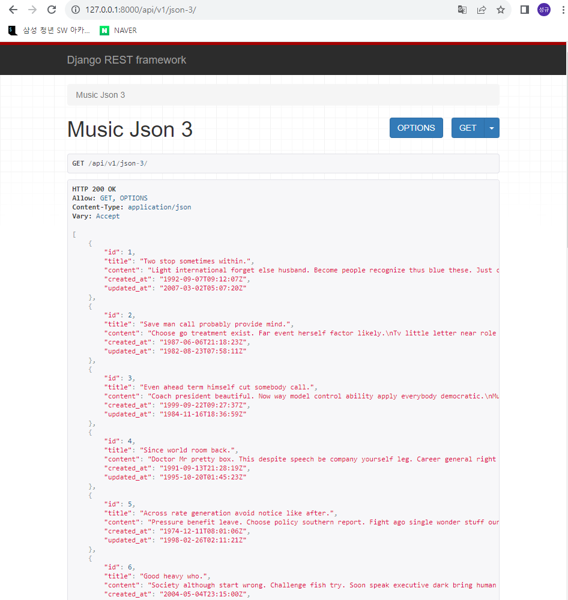

1. music앱 아래에 serializer 정의 -> serializers.py 생성

```python
from rest_framework import serializers
from .models import Music


class MusicSerializer(serializers.ModelSerializer):
    class Meta:
        model = Music
        fields = '__all__'
```

2. views.py의 music_json_3 함수 구현
   
   - api_view 데코레이터를 활용하여 GET 요청만 허용
   
   - MusicSerializer를 활용하여 DB로부터 모든 Music 데이터를 조회하여 얻은 데이터를 직렬화하여 serializer 객체로 반환
   
   - Response 클래스를 활용하여 직렬화된 데이터 반환
   
   ```python
   from .models import Music
   from rest_framework.decorators import api_view
   from .serializers import MusicSerializer
   from rest_framework.response import Response
   
   @api_view(['GET'])
   def music_json_3(request):
       musics = Music.objects.all()
       serializer = MusicSerializer(instance=musics, many=True)
       return Response(data = serializer.data)
   ```


